# 金字塔原理（第一篇）：表达的逻辑 

<!-- START doctoc generated TOC please keep comment here to allow auto update -->
<!-- DON'T EDIT THIS SECTION, INSTEAD RE-RUN doctoc TO UPDATE -->
<!-- **Table of Contents**  *generated with [DocToc](https://github.com/thlorenz/doctoc)* -->

- [第1章：金字塔结构的作用](#%E7%AC%AC1%E7%AB%A0%E9%87%91%E5%AD%97%E5%A1%94%E7%BB%93%E6%9E%84%E7%9A%84%E4%BD%9C%E7%94%A8)
  - [1.1 符合人脑的特性](#11-%E7%AC%A6%E5%90%88%E4%BA%BA%E8%84%91%E7%9A%84%E7%89%B9%E6%80%A7)
  - [1.2 结论先行，自上而下清晰组织](#12-%E7%BB%93%E8%AE%BA%E5%85%88%E8%A1%8C%E8%87%AA%E4%B8%8A%E8%80%8C%E4%B8%8B%E6%B8%85%E6%99%B0%E7%BB%84%E7%BB%87)
  - [1.3 每个子观点都简单清晰](#13-%E6%AF%8F%E4%B8%AA%E5%AD%90%E8%A7%82%E7%82%B9%E9%83%BD%E7%AE%80%E5%8D%95%E6%B8%85%E6%99%B0)
  - [1.4 观点的四种组织顺序](#14-%E8%A7%82%E7%82%B9%E7%9A%84%E5%9B%9B%E7%A7%8D%E7%BB%84%E7%BB%87%E9%A1%BA%E5%BA%8F)
- [第2章：金字塔结构的组成](#%E7%AC%AC2%E7%AB%A0%E9%87%91%E5%AD%97%E5%A1%94%E7%BB%93%E6%9E%84%E7%9A%84%E7%BB%84%E6%88%90)
  - [2.1 纵向关系：主题和子主题之间的关系](#21-%E7%BA%B5%E5%90%91%E5%85%B3%E7%B3%BB%E4%B8%BB%E9%A2%98%E5%92%8C%E5%AD%90%E4%B8%BB%E9%A2%98%E4%B9%8B%E9%97%B4%E7%9A%84%E5%85%B3%E7%B3%BB)
  - [2.2 横向关系：子主题之间的关系](#22-%E6%A8%AA%E5%90%91%E5%85%B3%E7%B3%BB%E5%AD%90%E4%B8%BB%E9%A2%98%E4%B9%8B%E9%97%B4%E7%9A%84%E5%85%B3%E7%B3%BB)
  - [2.3 序言：吸引读者对文章的注意](#23-%E5%BA%8F%E8%A8%80%E5%90%B8%E5%BC%95%E8%AF%BB%E8%80%85%E5%AF%B9%E6%96%87%E7%AB%A0%E7%9A%84%E6%B3%A8%E6%84%8F)
- [第3章：金字塔结构的搭建方法](#%E7%AC%AC3%E7%AB%A0%E9%87%91%E5%AD%97%E5%A1%94%E7%BB%93%E6%9E%84%E7%9A%84%E6%90%AD%E5%BB%BA%E6%96%B9%E6%B3%95)
  - [3.1 自上而下法](#31-%E8%87%AA%E4%B8%8A%E8%80%8C%E4%B8%8B%E6%B3%95)
  - [3.2 自下而上法](#32-%E8%87%AA%E4%B8%8B%E8%80%8C%E4%B8%8A%E6%B3%95)
  - [3.3 初学注意事项](#33-%E5%88%9D%E5%AD%A6%E6%B3%A8%E6%84%8F%E4%BA%8B%E9%A1%B9)
- [第4章：序言的写法](#%E7%AC%AC4%E7%AB%A0%E5%BA%8F%E8%A8%80%E7%9A%84%E5%86%99%E6%B3%95)
  - [4.1 讲故事的结构](#41-%E8%AE%B2%E6%95%85%E4%BA%8B%E7%9A%84%E7%BB%93%E6%9E%84)
    - [(1) 作用](#1-%E4%BD%9C%E7%94%A8)
    - [(2) “背景”：基于读者共识](#2-%E8%83%8C%E6%99%AF%E5%9F%BA%E4%BA%8E%E8%AF%BB%E8%80%85%E5%85%B1%E8%AF%86)
    - [(3) “冲突”：推动情节引发疑问的都可以](#3-%E5%86%B2%E7%AA%81%E6%8E%A8%E5%8A%A8%E6%83%85%E8%8A%82%E5%BC%95%E5%8F%91%E7%96%91%E9%97%AE%E7%9A%84%E9%83%BD%E5%8F%AF%E4%BB%A5)
    - [(4) 序言结构的四种顺序组织](#4-%E5%BA%8F%E8%A8%80%E7%BB%93%E6%9E%84%E7%9A%84%E5%9B%9B%E7%A7%8D%E9%A1%BA%E5%BA%8F%E7%BB%84%E7%BB%87)
      - [标准式：背景→冲突→答案](#%E6%A0%87%E5%87%86%E5%BC%8F%E8%83%8C%E6%99%AF%E2%86%92%E5%86%B2%E7%AA%81%E2%86%92%E7%AD%94%E6%A1%88)
      - [开门见山式：答案→背景→冲突](#%E5%BC%80%E9%97%A8%E8%A7%81%E5%B1%B1%E5%BC%8F%E7%AD%94%E6%A1%88%E2%86%92%E8%83%8C%E6%99%AF%E2%86%92%E5%86%B2%E7%AA%81)
      - [突出忧虑式：冲突→背景→答案](#%E7%AA%81%E5%87%BA%E5%BF%A7%E8%99%91%E5%BC%8F%E5%86%B2%E7%AA%81%E2%86%92%E8%83%8C%E6%99%AF%E2%86%92%E7%AD%94%E6%A1%88)
      - [突出信心式：疑问→背景→冲突→答案](#%E7%AA%81%E5%87%BA%E4%BF%A1%E5%BF%83%E5%BC%8F%E7%96%91%E9%97%AE%E2%86%92%E8%83%8C%E6%99%AF%E2%86%92%E5%86%B2%E7%AA%81%E2%86%92%E7%AD%94%E6%A1%88)
    - [(5) 用关键句要点（第一论点）呈现文章结构](#5-%E7%94%A8%E5%85%B3%E9%94%AE%E5%8F%A5%E8%A6%81%E7%82%B9%E7%AC%AC%E4%B8%80%E8%AE%BA%E7%82%B9%E5%91%88%E7%8E%B0%E6%96%87%E7%AB%A0%E7%BB%93%E6%9E%84)
    - [(5) 序言长度](#5-%E5%BA%8F%E8%A8%80%E9%95%BF%E5%BA%A6)
    - [(6) 段落引言](#6-%E6%AE%B5%E8%90%BD%E5%BC%95%E8%A8%80)
    - [(7) 书写原则](#7-%E4%B9%A6%E5%86%99%E5%8E%9F%E5%88%99)
  - [4.2 常见模式](#42-%E5%B8%B8%E8%A7%81%E6%A8%A1%E5%BC%8F)
    - [(1) 适用场景](#1-%E9%80%82%E7%94%A8%E5%9C%BA%E6%99%AF)
    - [(2) 发出指示式](#2-%E5%8F%91%E5%87%BA%E6%8C%87%E7%A4%BA%E5%BC%8F)
    - [(3) 请求支持式](#3-%E8%AF%B7%E6%B1%82%E6%94%AF%E6%8C%81%E5%BC%8F)
    - [(4) 解释做法式](#4-%E8%A7%A3%E9%87%8A%E5%81%9A%E6%B3%95%E5%BC%8F)
    - [(5) 比较选择式](#5-%E6%AF%94%E8%BE%83%E9%80%89%E6%8B%A9%E5%BC%8F)
  - [4.2 咨询公司文章](#42-%E5%92%A8%E8%AF%A2%E5%85%AC%E5%8F%B8%E6%96%87%E7%AB%A0)
    - [(1) 项目建议书](#1-%E9%A1%B9%E7%9B%AE%E5%BB%BA%E8%AE%AE%E4%B9%A6)
    - [(2) 项目进度小结](#2-%E9%A1%B9%E7%9B%AE%E8%BF%9B%E5%BA%A6%E5%B0%8F%E7%BB%93)
- [第5章：论述子观点 —— 演绎推理、归纳推理](#%E7%AC%AC5%E7%AB%A0%E8%AE%BA%E8%BF%B0%E5%AD%90%E8%A7%82%E7%82%B9--%E6%BC%94%E7%BB%8E%E6%8E%A8%E7%90%86%E5%BD%92%E7%BA%B3%E6%8E%A8%E7%90%86)
  - [5.1 介绍](#51-%E4%BB%8B%E7%BB%8D)
  - [5.2 演绎推理](#52-%E6%BC%94%E7%BB%8E%E6%8E%A8%E7%90%86)
    - [(1) 单层演绎推理](#1-%E5%8D%95%E5%B1%82%E6%BC%94%E7%BB%8E%E6%8E%A8%E7%90%86)
    - [(2) 连环演绎推理需要简化](#2-%E8%BF%9E%E7%8E%AF%E6%BC%94%E7%BB%8E%E6%8E%A8%E7%90%86%E9%9C%80%E8%A6%81%E7%AE%80%E5%8C%96)
    - [(3) 演绎推理要保持紧凑、最好用在较低的层级上](#3-%E6%BC%94%E7%BB%8E%E6%8E%A8%E7%90%86%E8%A6%81%E4%BF%9D%E6%8C%81%E7%B4%A7%E5%87%91%E6%9C%80%E5%A5%BD%E7%94%A8%E5%9C%A8%E8%BE%83%E4%BD%8E%E7%9A%84%E5%B1%82%E7%BA%A7%E4%B8%8A)
    - [(4) 要点和例子](#4-%E8%A6%81%E7%82%B9%E5%92%8C%E4%BE%8B%E5%AD%90)
  - [5.3 归纳推理](#53-%E5%BD%92%E7%BA%B3%E6%8E%A8%E7%90%86)
  - [5.4 两者区别](#54-%E4%B8%A4%E8%80%85%E5%8C%BA%E5%88%AB)

<!-- END doctoc generated TOC please keep comment here to allow auto update -->

## 第1章：金字塔结构的作用

### 1.1 符合人脑的特性

(1) 人脑对事物具有归类组织的特点，根据“共性”将事物组织起来：例如星空和星座

(2) 人一次记忆无法超过7个项目，需要通过逻辑关系对它们进行组织

例子：买菜清单

### 1.2 结论先行，自上而下清晰组织

(1) 事先对思想进行归类概括、自上而下呈现

(2) 听众可以直接获取表达的逻辑、而不需要自己从散乱的信息中总结

### 1.3 每个子观点都简单清晰

(1) 层次化的概括总结，结构中的每一个逻辑组织都足够简单，如果太复杂就说明还可以进一步拆分

(2) 如何判定逻辑是否够简单:  (1) 上层思想是对下层一组思想的概括；（2）每组的思想都属于同一逻辑范畴；(3) 每组的思想都符合规范的逻辑顺序

### 1.4 观点的四种组织顺序

(1) 演绎顺序：大前提、小前提、结论

(2) 时间顺序/步骤顺序：第一、第二、第三

(3) 结构顺序/空间顺序：波士顿、纽约、华盛顿

(4) 程度顺序/重要性顺序：最重要、次要、等等

## 第2章：金字塔结构的组成

构思金字塔结构的入手点

(1) 主题和自主题之间的纵向关系

(2) 各个子主题之间的横向关系

(3) 语言的叙述方式

### 2.1 纵向关系：主题和子主题之间的关系

作用：避免难以理解的“串行叙事”，把观点之间“抽象层次”提现出来。

技巧：引导“疑问/回答”式的对话，在上一个层次引发读者的疑问，在下一个层次进行回答。

练习此技能的价值：迫使你在理清思路时，从视觉上使纵向的疑问/回答式对话关系清晰化，而每一个表述都能够引发读者的疑问并在下一个层次上给予回答。

例子：

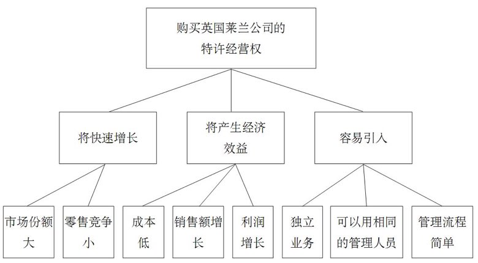

### 2.2 横向关系：子主题之间的关系

**作用**：回答上一个层次提出的疑问时、把答案中的观点组织清晰

**方法**：(1) 使用归纳逻辑来组织；(2) 使用演绎逻辑来组织

**演绎逻辑**：背景表述 ➡️ 观点对象表述 ➡️ 两种表述都成立时演绎出的结论

**归纳逻辑**：观点1、观点2、…… ➡️ 从逻辑共同点中归纳出的结论（例如下面例子中归纳出的“波兰将受坦克入侵”）

### 2.3 序言：吸引读者对文章的注意

方法：追溯问题的起源和发展，故事式呈现方式，即——背景➡️冲突➡️疑问➡️回答

作用：确保和读者站在同一位置上，确保将核心重点放在文章最前面，确保以最直接的方式传递正确信息

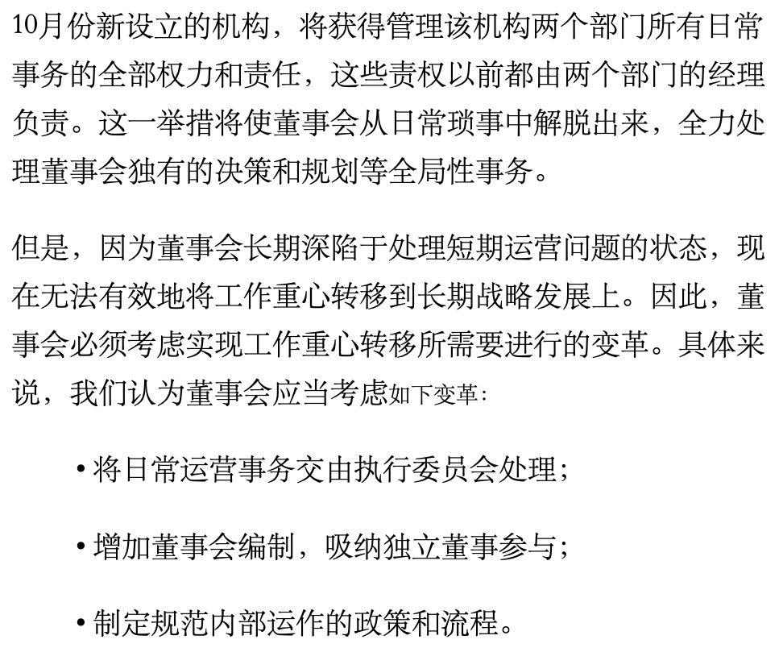

## 第3章：金字塔结构的搭建方法

### 3.1 自上而下法

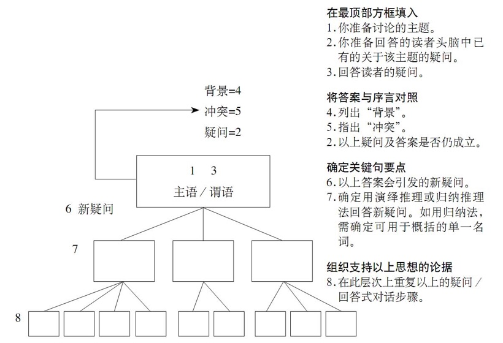

序言构思：

1.1：提出主题思想（如果想不清楚，跳到步骤1.2）

1.2：设想读者的主要疑问（如果想不清楚，跳到步骤2.1）

1.3：写出针对该问题的回答

序言的编写步骤：

2.1：说明“背景”（“背景”要能服务“主题思想”，并且是一个不会引起争议的表述）

2.2：指出“冲突”（“冲突”要足以引导读者提出“主要疑问”）

2.3：写序言：背景 —— 冲突 —— 疑问 —— 回答

2.4：与受众进行疑问/回答式对话

序言写好后，针对受众的新疑问，就可以展开新的疑问/回答对话，将金字塔结构递进展开

例子：

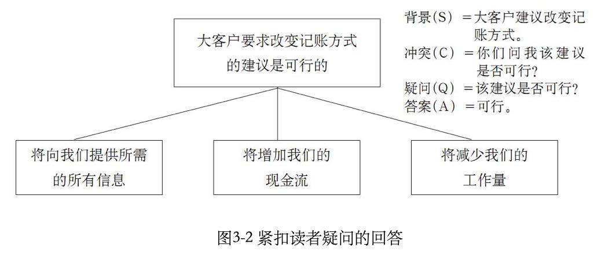

### 3.2 自下而上法

作用："主题"、“疑问”都想不清楚时，采用自下而上方法树立

**步骤1**：列出所有要点

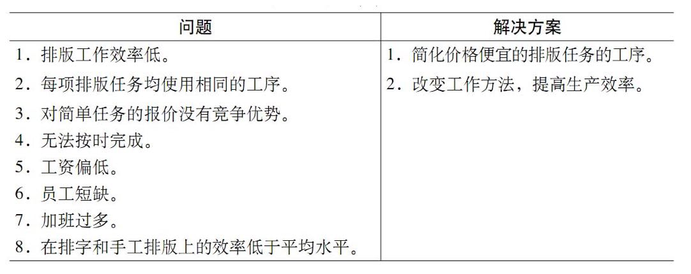

**步骤2**：找出因果逻辑关系

首先是凌乱的因果链

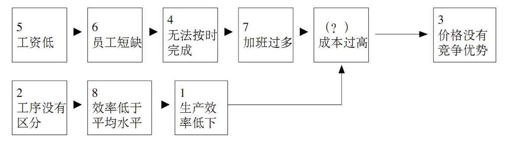

把它们近一步梳理和重整成两条清晰独立的思路

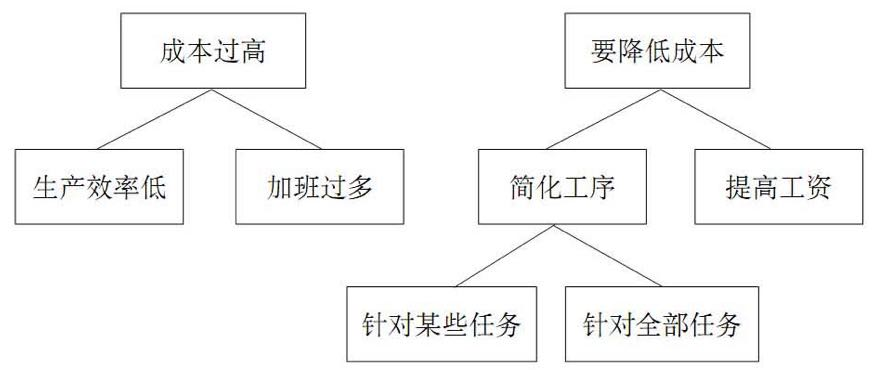

**步骤3**：找到要论述的主题和疑问

排版成本是最重要的部分是共识，作为“背景”；排版成本是否过高人们都不清楚，作为“疑问”，于是找出序言部分如下图的1 - 5，而6 - 7则用于展开金字塔的下一层结构

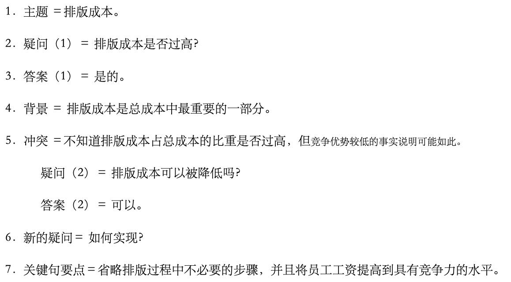

最终的成文

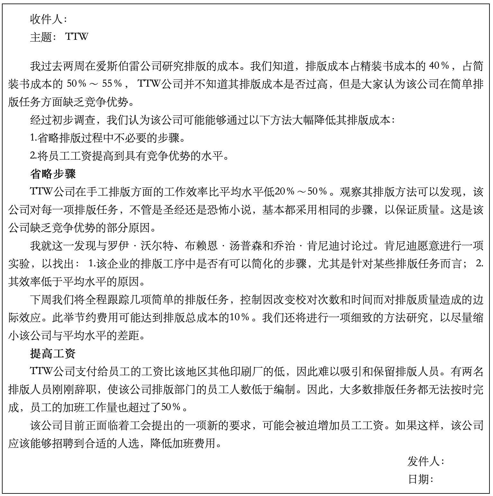

### 3.3 初学注意事项

(1) 先搭结构，首选自上而下

(2) 先多花时间思考序言

* 先写背景
* 历史背景在序言部分交代，而不是在正文论述当中忽然插入（除非是因果推导的一部分）
* 只写读者已知的内容，避免给读者产生拉偏主题的疑问

(3) 子观点之间首选归纳推理法（直接），而非演绎论证法（需要读者更多的思考和理解）

## 第4章：序言的写法

### 4.1 讲故事的结构

#### (1) 作用

先介绍读者熟悉的某些“背景”，说明发生的“冲突”，并由此引发读者的“疑问”，然后针对该“疑问”给出“答案”

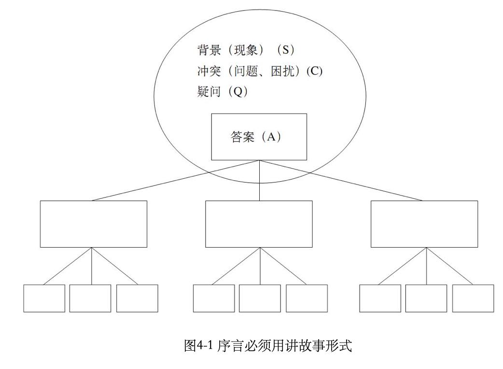

讲故事的方式做到引人入胜、激发兴趣

背景部分从读者认可的信息、使其从简单部分开始理解，易于接受

#### (2) “背景”：基于读者共识

能够做出关于文章主题“独立”、“无争议”表述的时，即能够锁定特定的时间和空间时，就说明能够引入背景了

* 读者范围界定清晰时：很容易针对读者的认知引入

* 读者范围很广时：“培养”而非“提醒”读者想起已有的某种疑问，依赖读者在文章主题方面具有的通常背景知识（例如读者共同的专业领域，读者都在读的杂志，......）

#### (3) “冲突”：推动情节引发疑问的都可以

能推动情节发展的因素，能促使读者提出“疑问”的都是冲突。不局限

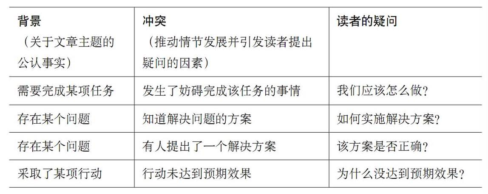

#### (4) 序言结构的四种顺序组织

序言的结构：背景、冲突、疑问、解决方案

组织顺序：可以灵活变化，创造出不同的风格

##### 标准式：背景→冲突→答案

##### 开门见山式：答案→背景→冲突

##### 突出忧虑式：冲突→背景→答案

##### 突出信心式：疑问→背景→冲突→答案

#### (5) 用关键句要点（第一论点）呈现文章结构

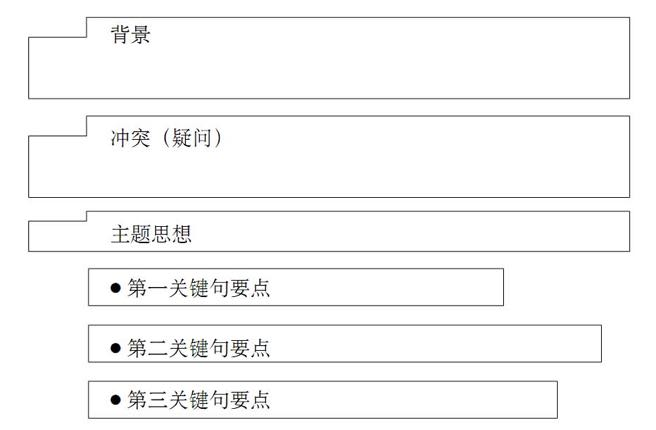

写作要求：(1) 引起受众关于主题的疑问；(2) 呈现文章结构；(3) 必须清晰呈现文章思想、而非硬塞读者无法理解的词汇

作用：

* 对于长文章：让读者在开始阅读的最初30秒了解全部思路、以决定接下来读哪部分

* 对于短文章：不用单独列出，分散在每段中作为主题句，并给这个句子加下划线（或加粗）即可

#### (5) 序言长度

以展开正文之前，受众能够站在同一位置为目标，但不要包含细节

通常：2-3段；较长的：背景+冲突部分3-4段；也可以短到只有一句话

#### (6) 段落引言

序言部分引出了3个关键句（如下图红框处）：背景 - 冲突 - 疑问 - 答案（3个关键句）

这3个关键句激发读者的疑问是：“它们是如何起作用的”，这些将在接下来的段落中以“引言”的形式进行衔接

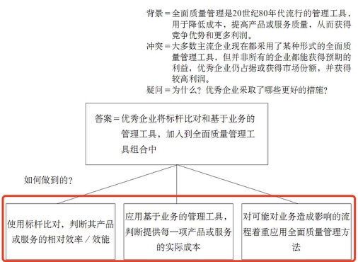

序言和引言的内容都可以拆解成“背景 - 冲突 - 疑问 - 答案”的形式，差别是

* 全文序言：目的是提示文章主题；
* 段落1引言：目的是提示当前主题、与全文主题相关
* 段落2-N引言：目的是提示当前主题、与前面已讨论主题

#### (7) 书写原则

原则1：“提示”读者而不是“告诉”读者

原则2：三要素（“背景”/“冲突”/“答案”）必须齐全、但顺序可以灵活、保证故事结构

原则3：长度取决于读者和主题需要

### 4.2 常见模式

#### (1) 适用场景

针对不同的工作内容，可以采用不同的序言模式

|                                                | 发出指示式 | 请求支持式 | 解释做法式 | 比较选择式 |
| ---------------------------------------------- | ---------- | ---------- | ---------- | ---------- |
| 我们应该做什么？                               | ✅          |            |            | ✅          |
| 我们应该如何做 * 将如何做 * 是如何做 | ✅          |            | ✅          |            |
| 我们是否应该这样做？                           |            | ✅          |            |            |

#### (2) 发出指示式

|      | 例子1         | 例子2             | 例子3                          |
| ---- | ------------- | ----------------- | ------------------------------ |
| 背景 | 我们打算达成X | 需要你去做X       | 想传授“问题”连锁店商品展示方法 |
| 冲突 | 需要你们来做Y | 必须按Y的方式进行 | 需要各地区提供一家“问题”店     |
| 疑问 | 如何做Y       | 什么是Y的方式     | 如何提供这些信息               |

#### (3) 请求支持式

|      | 例子1                   |
| ---- | ----------------------- |
| 背景 | 遇到一个问题            |
| 冲突 | 解决方案需要xxx美元经费 |
| 疑问 | 应该批准吗？            |

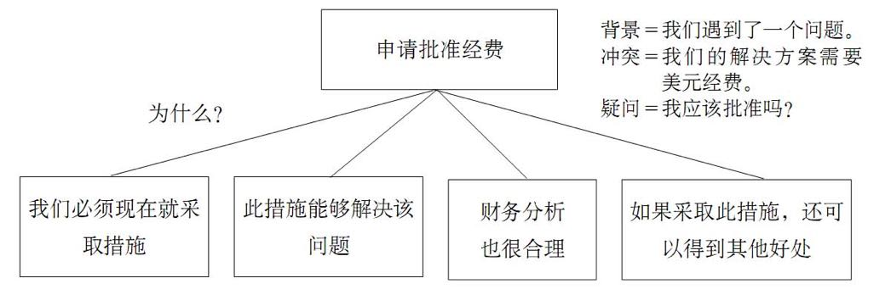

#### (4) 解释做法式

|      | 例子1               | 例子2              |
| ---- | ------------------- | ------------------ |
| 背景 | 必须做X             | 目前系统是X        |
| 冲突 | 还没做好关于X的准备 | 该系统不能正常工作 |
| 疑问 | 如何准备            | 如何改进           |

在接下来的段落中，将要介绍具体的方案。

出方案首先需要周全思考（如下图例子）

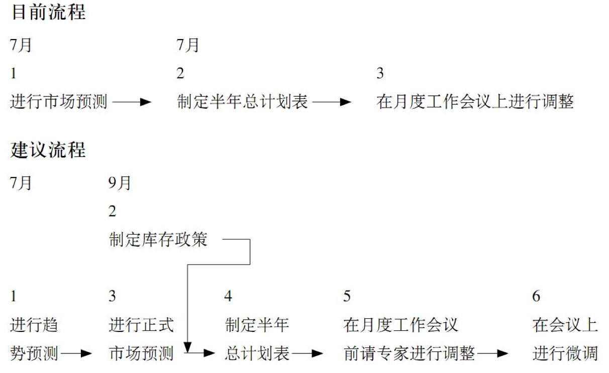

然后要精炼提取（如下图例子）

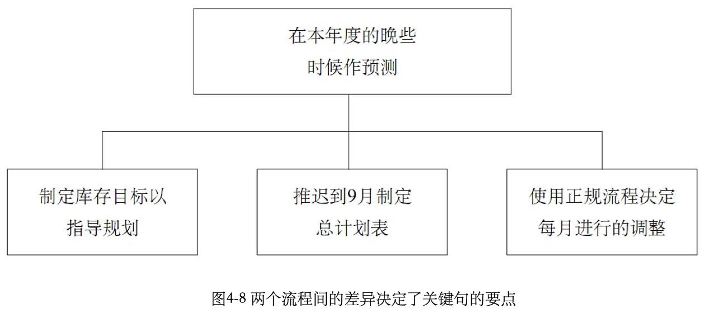

#### (5) 比较选择式

如果能彻底解决，就不会需要比较选择。面临比较选择：就意味着“在没找到解决办法的前提下，对可能的一些方案提出建议”；也意味读者已经了解这些替代方案。因此序言可以这样写

|      | 例子1                     |
| ---- | ------------------------- |
| 背景 | 希望做X                   |
| 冲突 | 有几种不同的方案：A，B，C |
| 疑问 | 哪种最合适                |

接下来要组织关键句，来回答引出的疑问

A) 如果方案C全面有优势：围绕评估标准来写：

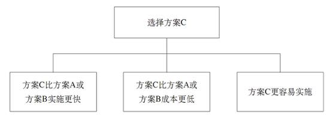

B) 如果方案C不具备全面优势，但最合适：通过说明所有个能方案提出观点：

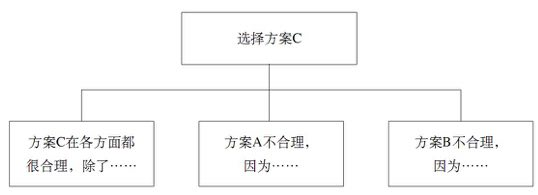

C) 如果任何一个方案都无法达到目标，此时的“疑问”是“哪一个/该做什么”，而对应的回答是：

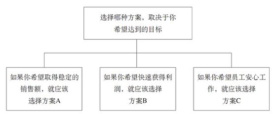

### 4.2 咨询公司文章

#### (1) 项目建议书

|      | 新客户                                               | 老客户               |
| ---- | ---------------------------------------------------- | -------------------- |
| 背景 | 客户遇到一个问题                                     | 客户遇到一个问题     |
| 冲突 | 客户决定聘请第三方帮助                               | 希望通过咨询我们解决 |
| 疑问 | 该聘请吗我们？                                       | 将如何解决问题？     |
| 答案 | 我们理解该问题，有合理方法，有丰富经验，安排非常合理 | 围绕解决该问题展开   |

“冲突”/“疑问”可以不直接写出来，例如下面的例子

#### (2) 项目进度小结

|      | 进度阶段1                                       | 进度阶段2                                        |
| ---- | ----------------------------------------------- | ------------------------------------------------ |
| 背景 | 一直在处理X问题                                 | 上一阶段已经确认愿意是产能                       |
| 冲突 | 如之前所说，第一步是确立Y是否成立，这一步已完成 | 你说认为这不是长期问题，要求我们调查，调查已完成 |
| 疑问 | 发现了什么？                                    | 发现了什么？                                     |
| 答案 | 是产能导致了X问题                               | 发现产能问题仍然存在，并且情况更严重             |

## 第5章：论述子观点 —— 演绎推理、归纳推理

### 5.1 介绍

第3章介绍纵向关系构建：即如何将观点组织成父子层级结构

第5章介绍横向关系构建：在展开一个子观点时，可以用如下两种逻辑推理来组织支撑内容，完成子观点的论述

(1) 演绎推理

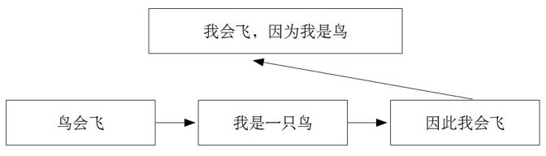

(2) 归纳推理

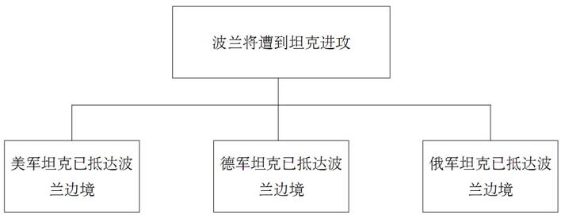

### 5.2 演绎推理

#### (1) 单层演绎推理

结构：大前提 ➡️ 小前提 ➡️ 推导出的论述

|       | 方式1                            | 方式2                |
| ----- | -------------------------------- | -------------------- |
| 步骤1 | 阐述世界已存在的某种情况         | 出现的问题或现象     |
| 步骤2 | 阐述世界同时存在的相关情况       | 产生问题的根源、原因 |
| 步骤3 | 说明两种情况同时存在时的隐含意义 | 解决问题的方案       |

更多的例子

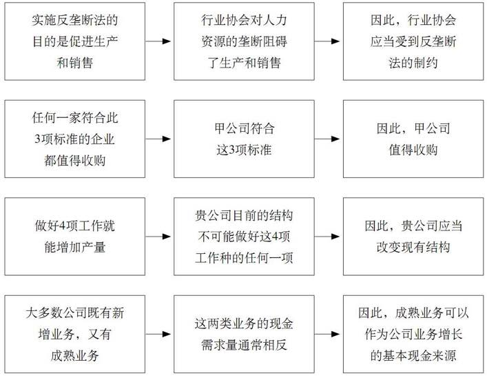

#### (2) 连环演绎推理需要简化

左侧是两个演绎推理逻辑连环衔接在一起，列举繁琐，需要按右侧的方法进行重新组织

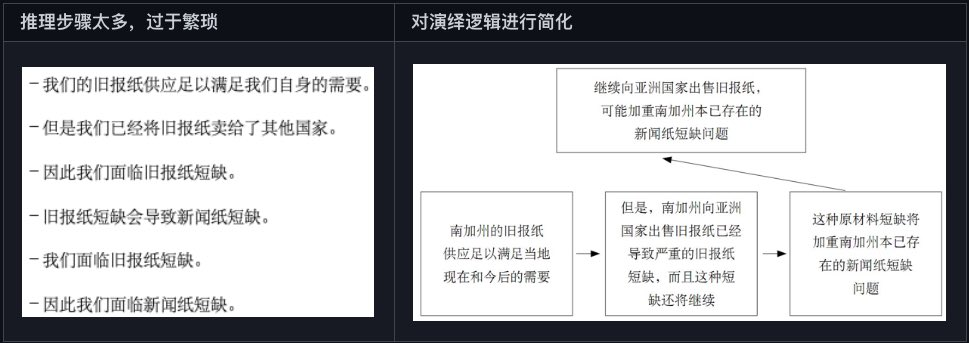

#### (3) 演绎推理要保持紧凑、最好用在较低的层级上

演绎推理强迫读者思考，下面是个反例，读者将很难理解和接受如此庞大的信息量

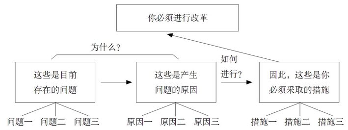

为此用归纳推理进行重组，让四个信息单元（1个在第一层，3个在第二层）信息含量都精简清晰

为了实现这个重组：将“如何做到”放在“为什么”之前，好处是这个场景中读者更关心“如何做”

要点是：(A) 同一主题信息集中在一起；(B) 不同主题之间思维界限非常明确

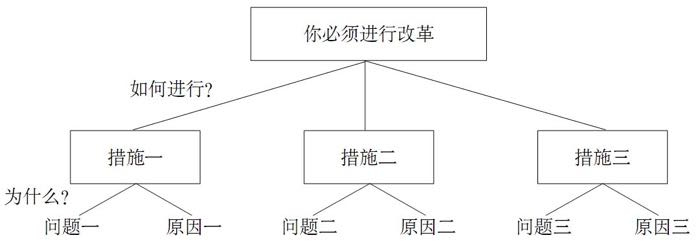

但假如换了一个场景（例如要放弃降成本、而是卖公司），关注点就落在了“为什么”上，只能在顶部层级使用演绎推理。但要注意，三个子观点要保持紧凑，不要在逻辑当中插入过多的展开内容。

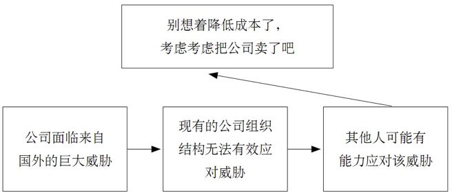

#### (4) 要点和例子

演绎推理过程不要超过4个步骤，推导出的结论不要超过2个

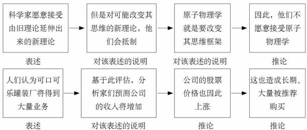

### 5.3 归纳推理

难点在于：需要从不同内容中找出共性，并且要保证这种归纳逻辑是确立的（例如“不面对现实”不代表“故意为之”，因此前者归纳出后者）

下面三个归纳推理，都能用一个词来概括

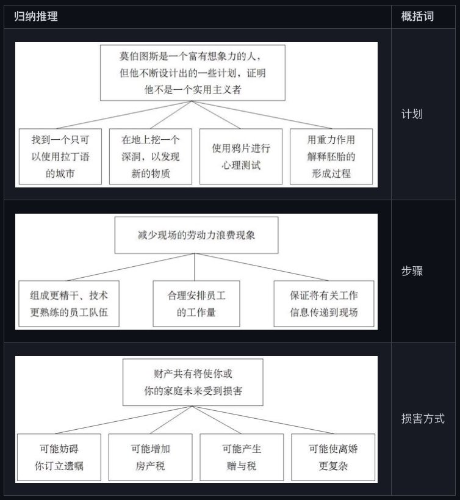

### 5.4 两者区别

演绎推理：第二点是对第一点主语或谓语的论述。

归纳推理：同组中的思想具有类似的主语或谓语。

