# 金字塔原理（第三篇）：解决问题的逻辑

短文章适合使用“背景 - 冲突 - 疑问”模式，长文章却比较困难。

原因之一：长文章涉及信息太多、需要界定问题，既决定哪些是希望与人交流的。

~~~txt
例如：写哪个主题、取决于读者实现是否知道
• 我们应该做什么(如果不知道解决方案)？
• 我们应该做吗(如果已经给出了解决方案)?
• 我们应该怎么做？你会怎么做？(如果已经知道且接受解决方案）
~~~

原因之二：还需要分析问题，寻找解决步骤或理由。这需要有条理地搜集和分析数据，转换为金字塔的形式

理想的过程如下，难点在于前两部，再接下来两章分别介绍

~~~txt
理想过程：界定问题->结构化(分析问题)->分析/找到(解决方案)->组成金字塔结构(与他人交流)
~~~

## 第8章 界定问题

问题：现状和目标之间的差距；解决方案：如何从现状到达目标。界定方法如下：

| 问5个问题                                           | 目标           | 用于     |
| --------------------------------------------------- | -------------- | -------- |
| 1.是否有/是否可能有问题（或机会）？ 2.问题在哪 | 界定问题       | 序言     |
| 3.为什么存在（根源、原因）                          | 结构化分析原因 | 文章观点 |
| 4.能做什么 5.应该做什么                        | 寻找解决方案   | 文章观点 |

### 8.1 界定问题的框架

现状与目标之间差距的产生，来自特定背景和条件，也是分析的入手点

#### (1) 展开说明框架中的各要素

例子：工业不动产公司一直在用的销售方法失灵了、首先要找到问题出在哪了（界定问题）

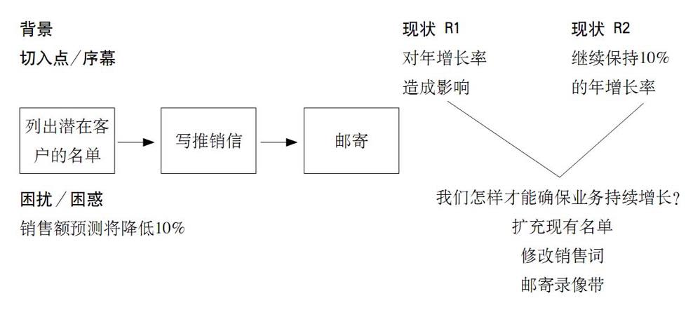

如果问题确实是由背景产生（上图的“切入点”/“序幕），那么从这里入手，思路如下

步骤1:回答下面三个问题

~~~txt
• 发生了什么事情？［背景（切入点/序幕+困扰／困惑）］ 
• 我们不喜欢它什么？（非期望结果R1） 
• 我们想要什么？（期望结果R2）
~~~

步骤2: 分析切入点/序幕这里入手。

~~~txt
在上述案例中，销售额降低的原因可能有
• 潜在客户名单已经过期，和/或 
• 推销信没有说服力，和/或 
• 邮寄效率低
~~~

步骤3:对问题进行结构话分析，建立诊断框架和逻辑树

#### (2) 把“界定的问题”写成序言

针对不同的场景、使用不同的方法

#### 场景1: 寻找原因和解决方法

直接把上面图示中的界定过程转换成序言（从左到右、从上到下顺序）

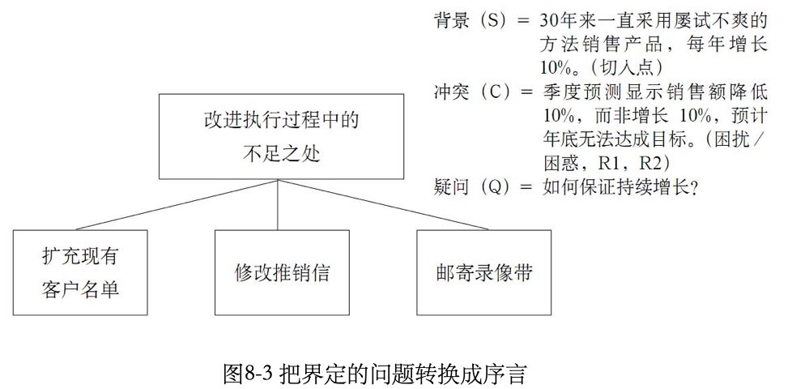

#### 场景2: 开门见山

直接说如何从现状到目标

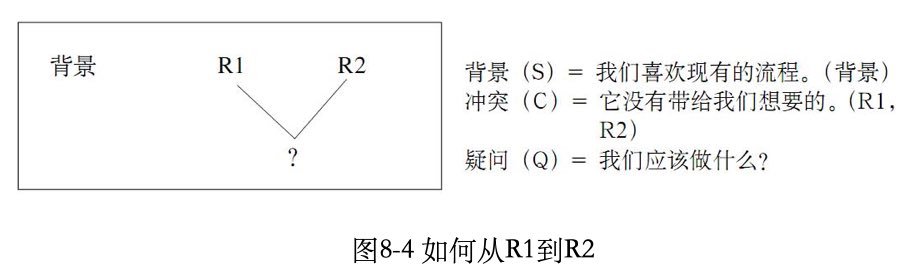

#### 场景3: 某个方法是否正确

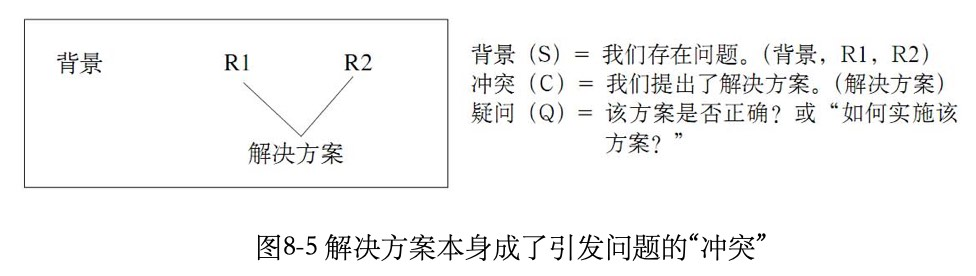

#### 场景4: 某个方法不可行（或没效果）

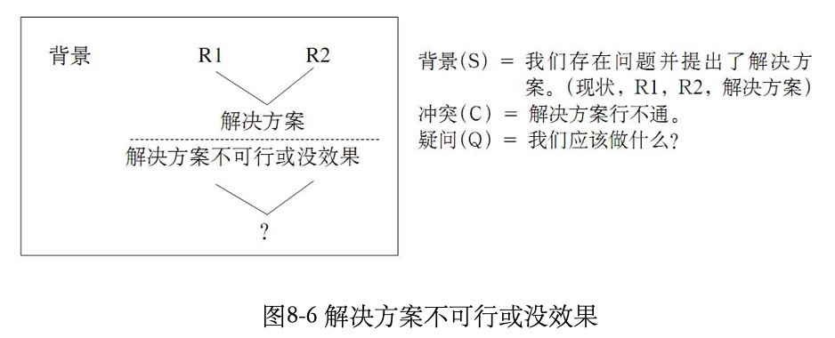

#### 场景5: 讨论较复杂的问题

下面是一个层级化的方案：

~~~txt
层级1：公司将新品放到超市进行试销、条件是支付试销费用
层级2：最近试销费用涨价、公司无法接受和支付
层级3：超市不再容许试销
~~~

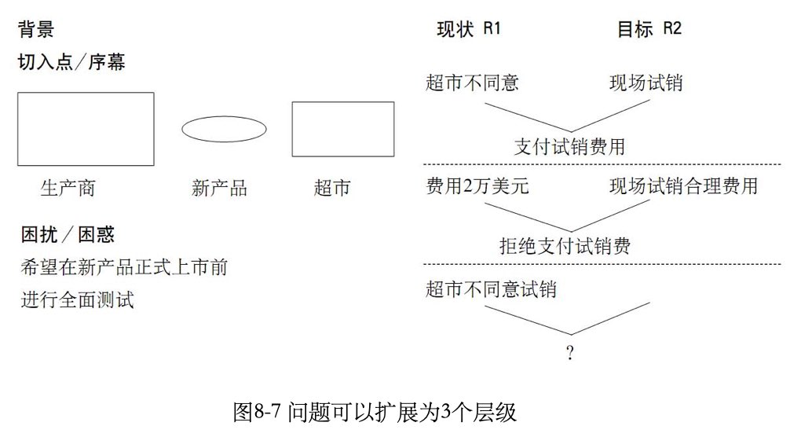

如何将其写成序言：与方法1类似、将最后的那项事实作为冲突

~~~txt
背景（S）= 为让超市同意我司新产品在其货架上进行约一周的试销，我司在过去几年里一直向其支付新产品试销费用。该费用每年都在增长，目前是2万美元，作为一周的货架使用费来说有点儿高。为了不让超市得寸进尺，我们决定拒绝支付该费用。（背景，层级一R1，层级一R2,层级一解决方案；层级二R1,层级二R2，层级二解决方案)

冲突（C）=遗憾的是，超市也拒绝了让我们的新产品作试销。(层级三R1)

疑问（Q）＝我们应该如何应对面临的问题？
~~~

#### 综上所述：整体步骤如下

~~~txt
• 展开问题的基本部分，如图87所示； 
• 你的解决方案处于哪一阶段（已经提出了，还是已经被接受了）； 
• 提出适当的疑问； 
• 检查序言是否呈现了界定的问题； 
• 检查金字塔是否回答了疑问。
~~~

### 8.2 展开问题的各要素

界定问题需要确定四个要素、分别是：(1) 背景(切入点、序幕)；(2) 困扰；(3) 现状(R1)；(4) 目标(R2)。下面是对这四个要素的说明。

#### (1) 切入点/序幕

序幕如同剧场大幕拉开时、展现在眼前舞台布景。展示的内容是企业/行业出现的问题、通常是某个信息结构/流程，即“什么东西出了问题”

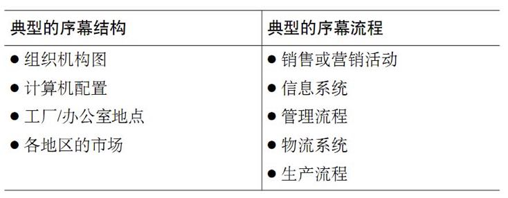

在确定序幕时，尽量作简单的设想和简短的描述，等到写序言时再展开。

#### (2) 困扰/困惑

存在/即将发生的事情，对序幕中的背景构成了威胁，引发不期望的结果发生

原因通常是：

| 分类             | 例子                                                         |
| ---------------- | ------------------------------------------------------------ |
| 外部原因         | 结构或流程所在环境以外的地方发生的变化，如出现新的竞争对手、改用新技术、政府或消费政策发生变化等 |
| 内部原因         | 公司内部的变化，如增加业务流程、安装新的计算机系统、进军新市场、调整产品线等 |
| 旧认知之外的原因 | 产品/流程的性能落后、运营水平低于平均水平、市场研究显示消费者态度可能发生改变等。 |

#### (3) R1（现状、不期望的结果）

读者需要设法解决或有可能面临的问题，或者是有可能抓住的机会，可能不止一个。

| 分类 | 例子                                                         |
| ---- | ------------------------------------------------------------ |
| 问题 | • 对公司结构或流程产生负面影响。  • 扰乱某一特定方面的工作。 |
| 机会 | • 实现全年增长目标。  • 将产品上市时间缩短1/3。  • 让超市收取的试销费用合理。  • 调整系统以保证正常运行。  • 有足够的生产能力满足预测的需求。 |

在示意图里用尽可能简短的文字加以说明，例如

~~~txt
例子1: 公司无法向市场提供服务，市场份额正在降低
例子2: 有可能导致销量下降，利润减少或财务状况恶化
例子3: 预计无法抓住市场机会
~~~

#### (4) R2（目标、期望的结果）

对R2进行尽可能具体和定量的描述，才能判别你取得的结果是否是期望结果。要做到准确描述，可以使用数字也可以用具体结果。例如

~~~txt
• 实现全年增长目标。 
• 将产品上市时间缩短1/3。 
• 让超市收取的试销费用合理。 
• 调整系统以保证正常运行。 
• 有足够的生产能力满足预测的需求。
~~~

### 8.3 寻找读者的疑问

情况不同读者的疑问也不同。要了解读者是否已经采取了措施、这直接决定文章的书写框架。通常情况下，读者希望解决下面的7种问题之一：其中1-3最常见；4-5是变形；6-7不常见

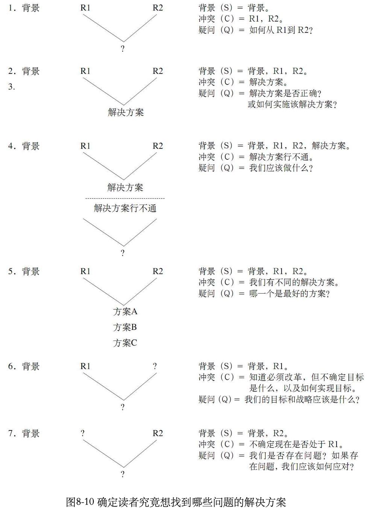

### 8.4 不同问题的序言书写

#### (1) 应该做什么

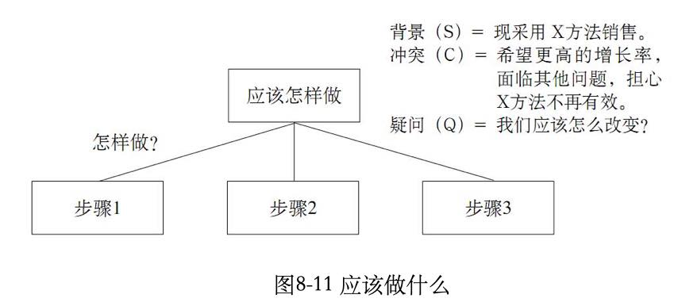

| 内容                                                         | 例子                                                         |
| ------------------------------------------------------------ | ------------------------------------------------------------ |
| 背景（S）=系统目前的工作情况。 冲突（C）=它不做它该做的工作。 疑问（Q）=如何让它做它该做的工作？ | 背景（S）=这是我们准备开展的活动。 冲突（C）=我们没能力开展该活动。 疑问（Q）=我们如何有能力开展该活动？ |

#### (2) 是否应该做我们想做的事情

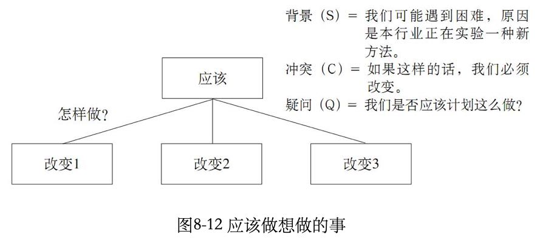

| 内容                                                         | 例子                                                         |
| ------------------------------------------------------------ | ------------------------------------------------------------ |
| 背景（S）=我们存在问题。 冲突（C）=我们计划采取行动。 疑问（Q）=该行动是否正确？ | 背景（S）=我们计划采取X行动。 冲突（C）=除非出现Y情况，否则我们不希望采取X行动 疑问（Q）=Y情况会出现吗？ |

#### (3) 应该做我们想做的事情

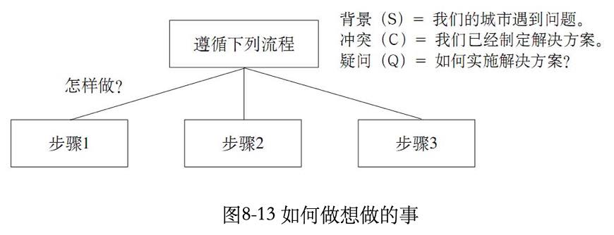

| 内容                                                         | 例子                                                         |
| ------------------------------------------------------------ | ------------------------------------------------------------ |
| 背景（S）=我们曾经存在问题。 冲突（C）=通过X行动我们解决了问题。 疑问（Q）=你是如何进行X行动的？ | 背景（S）=我们有（过去有）一个目标。 冲突（C）=我们正在安装一套系统或流程来实现该目标。 疑问（Q）=该系统或流程是如何运行的？ |

#### (4) 解决方案行不通，应该做什么

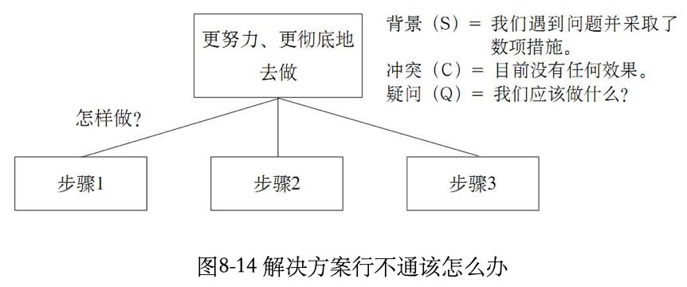

#### (5) 应该选择那种方案

错误写法：“我们有3种方法可以解决该问题”（读者会以为3种都能解决）

正确写法：“A方法不好→B方法不好→因此采用”

#### (6) 应该采用哪些战略

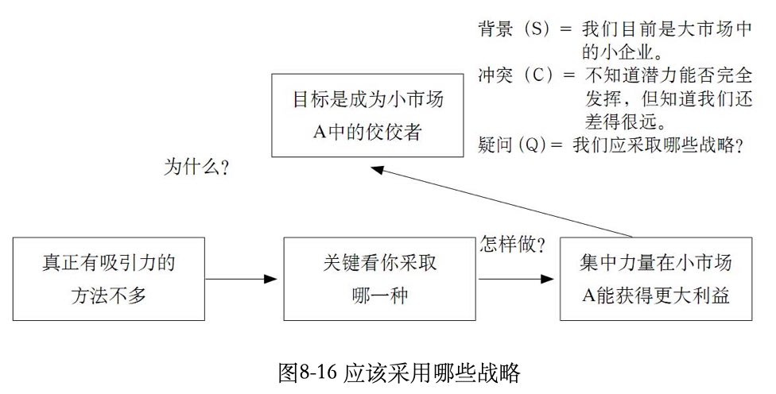

战略是文章的主要思想，关键句要点则描述制定战略的步骤

#### (7) 我们存在问题吗

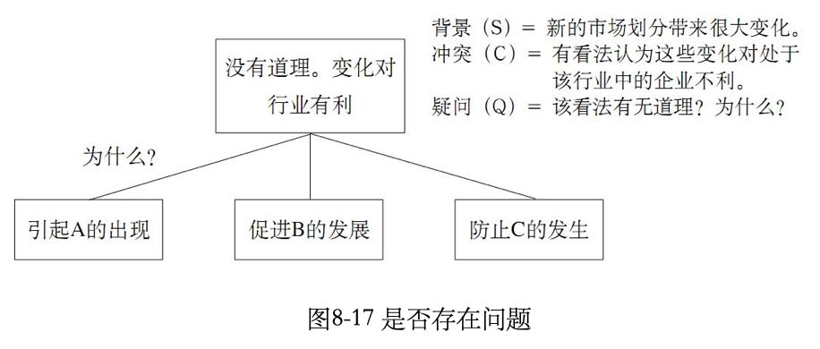

### 8.5 实战案例

略

## 第9章 结构化分析问题

在分析问题过程中，需要收集信息。如果能够建立一个诊断框架、按照逻辑树来收集信息。就可以事半功倍提高效率

~~~txt
收集信息→描述发现→得出结论→提出方案
~~~

### 9.1 错误方法的弊端和原因

原因：早期咨询行业内信息匮乏

缺点：劳民伤财，巨量信息增加分析难度，费用剧增

解决：设计并使用框架

### 9.2 设计诊断框架

用途：帮助设想问题所在领域的状况，揭示分析应该关注的要素或活动。比如下面的例子

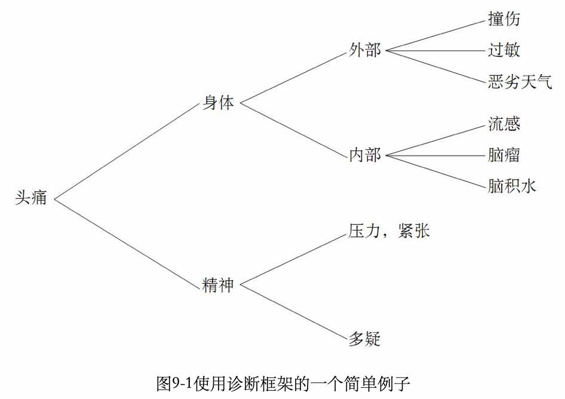

设计方法有三种：(1) 呈现有型结构；(2) 寻找因果关系；(3) 归类分组

#### (1) 借助已知的行业知识结构

借助领域（或企业/行业）自身的结构、即行业知识和经验来构建诊断框架，确定要分析哪些要素

例如：零售商经营结构

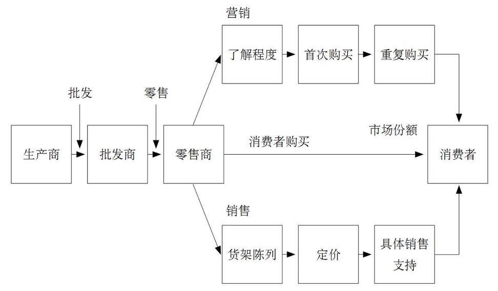

#### (2) 寻找因果关系

例如：顺着企业的财务结构示意图，分析和寻找投资回报率低的原因

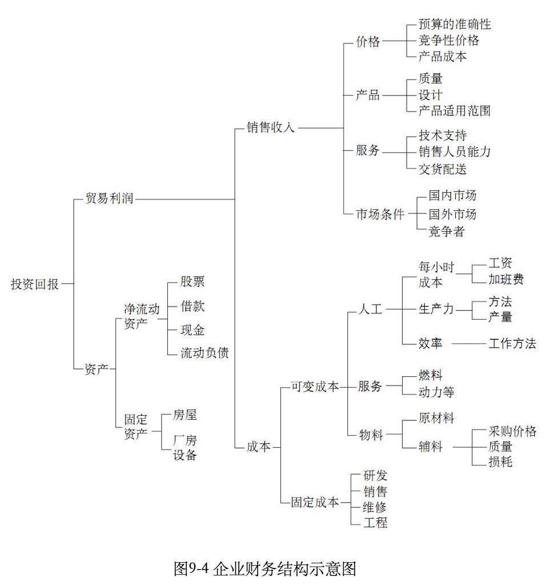

例如：从目标入手，按照某种财务结构，将相关要素展开

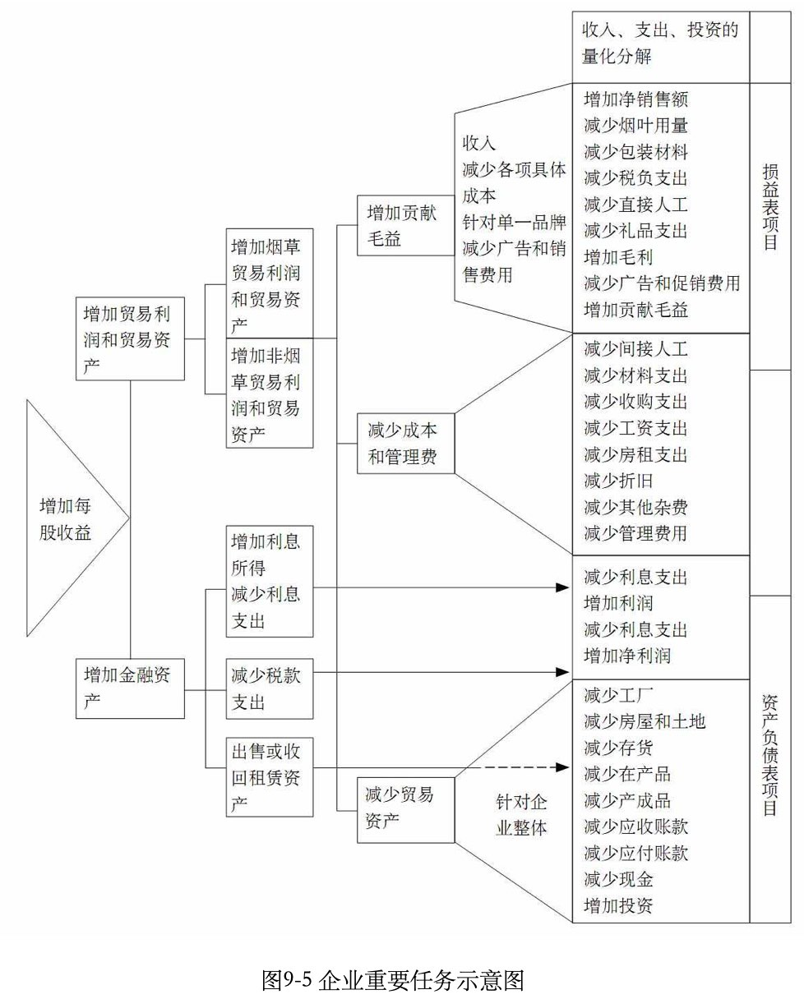

例如：从造成的问题入手，逐层拆解可能的原因

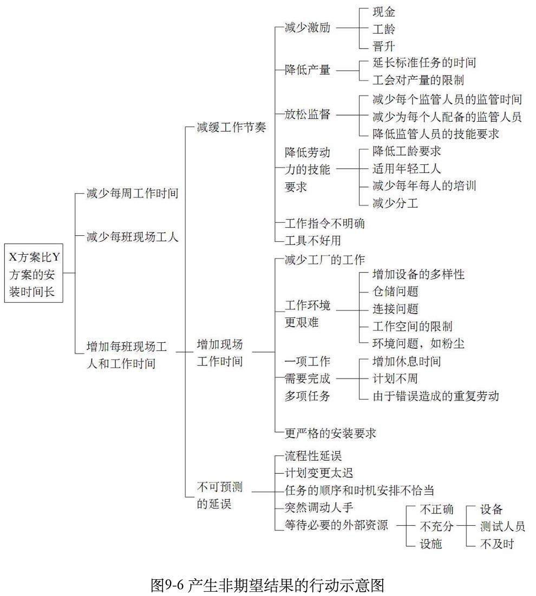

#### (3) 对原因进行归类分组

**建立诊断框架**

**方法1：**把所有可能原因按相似性分类

要保证分类方法是有助于综合分析的，要遵循“相互独立、完全穷尽”的原则进行分类

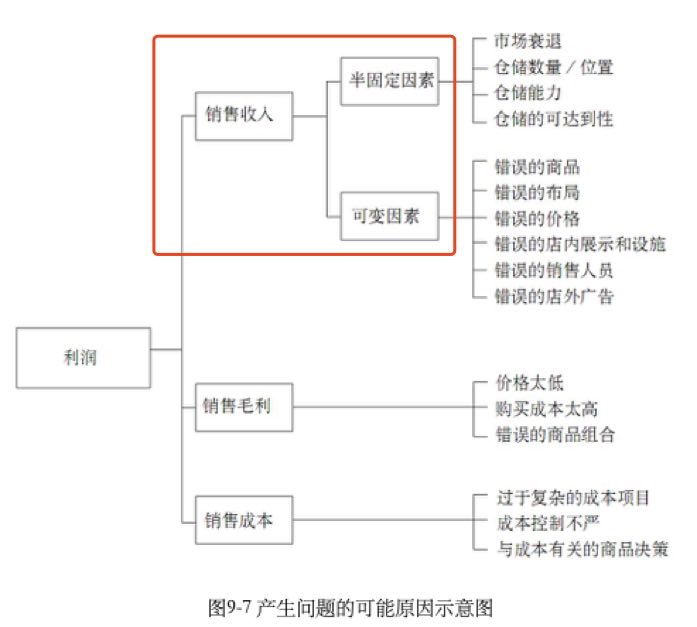

**方法2：**建立一个基于“是/否”问答的分析框架，例如下面的框架

**方法3**：基于流程结构（domain knowledge）按分析顺序对要素进行排序

例子如下

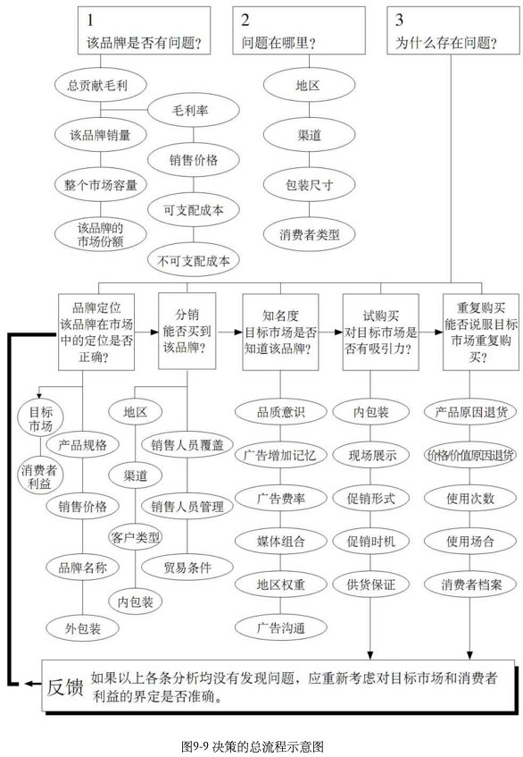

借助框架得到如下分析结论

~~~txt
营销计划不够周全，表现为包装不当、广告没有针对性、推销活动一团糟以及购买者不常使用该产品。
在这些不足之处中，排在前面的必须先于排在后面的得到改进。
因此，在把推销部门安排得井井有条之前，没有必要去说服人们更经常地使用产品；
同样，如果广告针对的是错误的人群，就没有必要花钱去推销。
~~~

**向读者说明分析结论**

~~~txt
用于论证变革必要性，通过与理想情况对比
• 该结构/系统导致Result 1。它的现状如何？（即公司的现状）
• 该结构/系统导致Result 1。从逻辑上分析，它在过去是什么样？（即你过去一直做的）

用于揭示不足之处
• 理想中的结构/系统导致预期的Result 2。它应该是什么样？（即为了实现目标你需要做的）
~~~

**与“决策树”或“PERT图”不同**

“诊断框架”是用于对相关因素进行确认或排除（剪枝）并提前告诉你合适可以结束调研。它与“决策树”或“项目评估检查技术图(PERT图)”（用于阐述要采取行动及必要性）是不同，后面这两种只是用于说明采取某种行动的必要性，不要混淆。

### 9.3 使用诊断框架

什么时候建立哪种框架？是全面框架还是部分框架？取决于对目标领域的了解、domain knowledge必不可少。

#### (1) 步骤1：从面临的问题入手

解决问题的诊断框架通常隐含在界定问题的“序幕”中，客户怀疑ISD部门不了解新系统、support team生产力没有发挥。希望知道如何有效使用生产力、提高support team的生产率

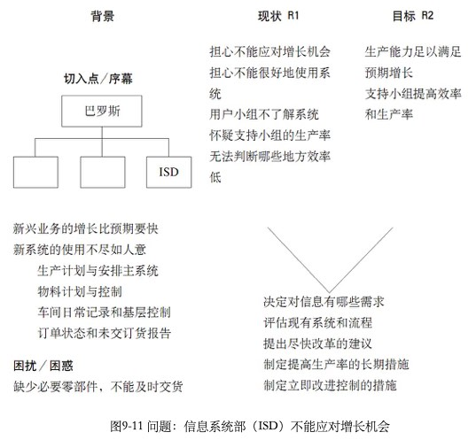

问题是工厂基层效率低和生产率低，其原因必然存在于工厂基层的作业和流程中。

如果按照下面面面俱到的方式收集信息，必然要进行大量的采访、资料整理和综合分析，不仅不能完全理解和吸收，还会很难客观地区分信息是否相关

~~~txt
• 增长预测 
• 部门管理目标 
• 商业信息和管理需求 
• 现有系统和流程 
• 效率低的领域，生产率低的原因 
• 控制差的原因 
• 确保库存准确的措施，账簿－库存不相符的记录 
• 现有资源，如何利用
~~~

需要一个分析框架、来有针对性的收集信息

#### (2) 步骤2：建立框架有针对性的分析问题

首先了解企业的系统流程、绘制流程图

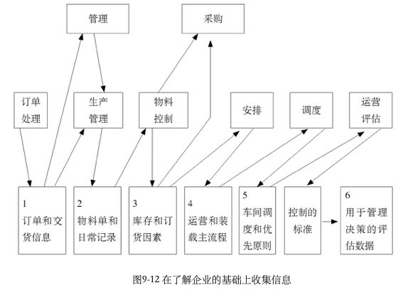

以流程图为参照，设想哪些环节存在问题，如果“是”，那么希望继续了解什么问题

~~~txt
1．订货和交货时间 —— 是否承诺的交货时间没有竞争力？是否按承诺的时间交货？
2．采购物品 —— 采购原材料、零部件和辅料有无延误或成本过高的情况？
3．库存物品供给 —— 是否因为短缺而影响销售？是否因为外部存放而增加成本？
4．现有生产能力 —— 生产能力能否满足预测的需求？
5．系统成本 —— 局部的管理控制有没有造成整个系统的失衡并增加其他部分的成本？
6．管理报告 —— 订单状态和劳动效率报告能否起到必要的控制作用？
~~~

接下来着手收集信息以回答各个问题

~~~txt
1. 需要知道问题及信息与所做分析的相关性
2. 每收集到一个答案，则根据答案决定是否要解答下一层问题，还要去想、下一层里是否有先前没有想到的点
3. 要确定每件资料的来源、收集任务分派、时间表和费用
4. 借助逻辑树找到可能的解决方案，对领域造诣很深的人可以通过敏锐的洞察提出创造性的解决方案
~~~

### 9.4 建立逻辑树

#### (1) 寻找解决方案

#### (2) 寻找各组思想的缺陷

### 9.5 是非分析问题

