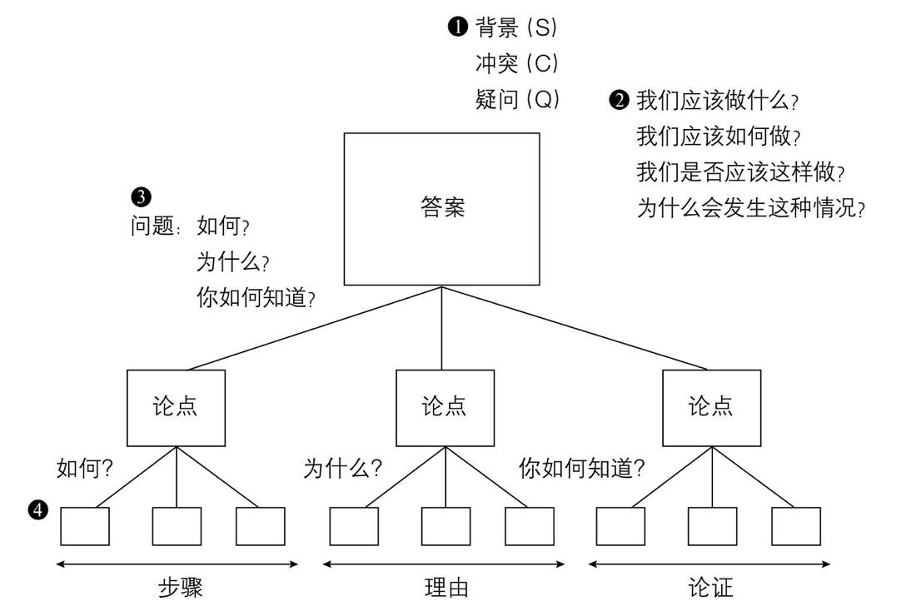
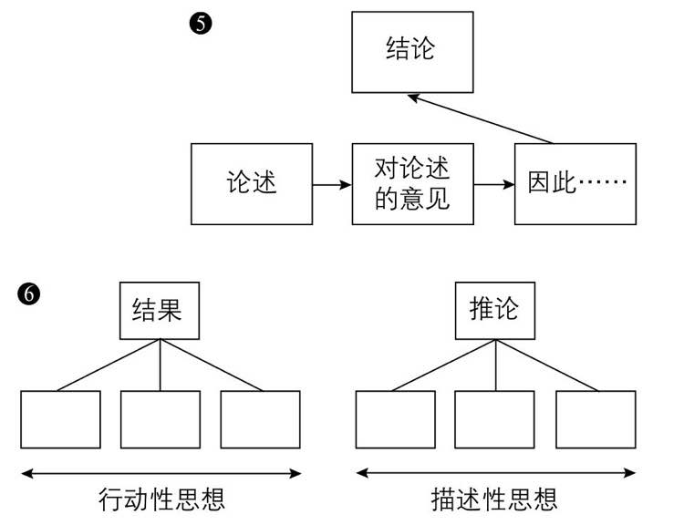
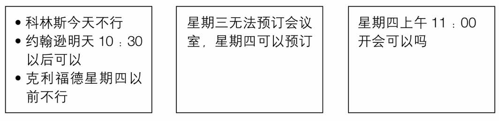
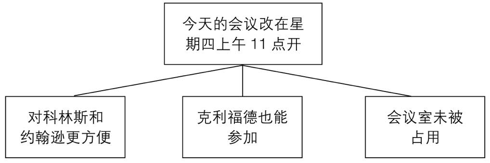
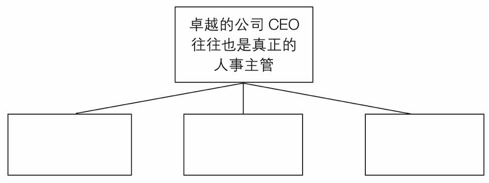

# 金字塔原理2-实战篇(第1篇): 为什么使用金字塔

# 序言

本书包含4个部分6大练习，关注在

1. 金字塔架构
2. 找出思想间的纵向练习
3. 找出思想间的横向练习
4. 序言
5. 建立金字塔结构的步骤
6. 技巧培养

# 前作回顾

金字塔结构

~~~txt
1. 序言：告诉一个读者已经知道的故事、用“背景”“冲突”“疑问”的结构来组织
2. 主题：大部分文章是在回答这4个问题
3. 顶层思想：序言之后提出的论点、只涉及这三类问题
4. 顶层思想展开：采用疑问回答的方式引入纵向关系：
(1) 顶层思想是“如何”，下一层展开的内容就是“步骤”
(2) 顶层思想是“为什么”，下一层展开的就是“理由”
(3) 顶层思想是“如何知道”，下一层展开的就是“论证”
~~~

展开一个论点的两种方式

~~~txt
5. 采用演绎推理：第3个思想由前面2个推到出
6. 采用归纳推理：关注不同思想之间的共性
~~~

~~~txt
7. 三种逻辑顺序
~~~

# 练习1：金字塔概念

## 1.1 思考是归类分组的过程

要点：思考是归类分组的过程，清晰的写作，观点多半能形成金字塔结构

~~~txt
这部分练习的目标是说明写作风格和结构之间的差异。你会发现，作者往往不会一开始就表明重点，有时会放在最后，有时会藏在中间，还有时会用暗示的方式让读者自行领会。而且作者经常不会明确地说出他支持的论点，你可能需要自行推导。通过以下的练习，你可以自己判断金字塔结构是如何影响文章架构的。
~~~

### (1) 找出结构：观察金字塔结构如何清晰传递信息

#### 练习1A - 01：电话信息

原文

~~~txt
约翰·科林斯来电话说他不能参加下午3点的会议了。哈尔·约翰逊说他不介意晚一点开会，明天开也可以，但明天10：30以前不行。唐·克利福德的秘书说，唐·克利福德明天晚些时候才能从法兰克福赶回来。但会议室明天已经有人预订了，星期四可以预订。会议时间定在星期四上午11点似乎比较适合。您看行吗？
~~~

修改后

~~~txt
原定今天的会议可以改在星期四上午11点开吗？因为这样对科林斯和约翰逊都比较方便，克利福德也能参加，并且本周只有这一天还可以预订会议室。
~~~

#### 练习1A - 02：零售调查备忘录

原文

~~~txt
收件人：      日期：
发件人：      主题：零售价调查

在4月23日的信件中，我们提出两点改进石油零售价调查的意见。除了这些想法之外，我们还建议重估最新被调查的店家数。目前我们调查的多是自助式管理的店铺（包括加油站、杂货店等），这些调查结果会影响市场的实际价格。在我们调查的705家Arc加油站中，只有243家（比例为34%）店被归类为“A”级或是长期绩优店。这些店都销售兴旺，而这里的竞争也最激烈，因此我们认为这34%的店并不能反映市场的实际价格。事实上，我们建议只考虑“A”级店铺。显然，如果我们修改被调查的Arc加油站，我们也必须修改竞争对手的店铺数据，并使之有可比性。

最后，我们建议将计划中自助店的比例由50%改为70%，如此比较符合目前的市场现状。
零售价调查的重要性日益显著，因此我们必须采取行动，以确保所调查的资料能真实反映市场的现状。

感谢你的协助。
~~~

#### 练习1A - 03：电子档案管理分析报告

原文

~~~txt
尽管使用电子文件更高效，但是在实际操作和成本效益上仍存在一些问题。采用电子档案管理的问题有：
1.公司方面
a.公司无法承担保管文件（信息）的责任。
b.系统的档案分享需要配合调整员工的工作方式。
c.公司并未考虑处理文件产生的费用。
d.电子档案管理属于公司运营范围，不只是工作的自动化。

2.信息索引的需求
a.索引标准很关键——“新的功能”。
b.索引不能只是一个附加功能，而与文件的生成或接收无关。
c.对索引/检索的内容分析有很大需求。

3.技术
a.不能满足每个员工的使用需求。
b.个人使用档案时存在潜在风险。

4.效益
a.成本绩效和功能不能满足实际的需求。
b.企业没有急迫的需求，而且电子档案管理也会产生许多支出。
c.决策者认为目前的档案管理不存在问题。
~~~

## 1.2 金字塔原则

要点：各思想组之间的关系必须符合金字塔原则

* 原则1：上层是对下一层的概括
* 原则2：同一层中的思想必须属于同一个逻辑顺序
* 原则2：每组思想必须按照逻辑顺序来组织

### (1) 理清原文的问题：使其符合金字塔原则

#### 练习1B-1：电话信息

违背的金字塔原则：

~~~txt
□ 原则1：有些层次的思想并不是对其下一层次思想的总结概括。
□ 原则2：某些组中的思想不属于同一个逻辑范畴。
□ 原则3：某些组中的思想没有按照逻辑顺序来组织。
~~~

修正后

#### 练习1B-2：零售价格调查备忘录

#### 练习1B-3：电子档案管理分析报告

## 1.3 掌握文章思想

### (1) 掌握金字塔结构才能掌握文章思想

要点：把金字塔结构当作写作大纲来理清楚文脉、但是作者通常会对文字进行包装，阅读时需要从这些包装中把金字塔结构提炼出来，才能理解所读的文字

#### 练习1C-1：人事系统

原文

~~~txt
卓越的公司CEO往往也是公司真正的人事主管。普通的CEO与这些公司的优秀CEO所做的事之间有极大差异。首先，后者会充分参与企业的运作，了解基层人员的工作内容。其次，他们对质量的要求非常高，对“优秀”有独到的理解，而且有能力辨识优劣。而许多普通CEO最大的问题是无法分辨孰优孰劣，因此也就不知道什么样的质量要求才是合理的。最后，优秀的CEO还要确保负责最重要工作的人员具备岗位所必需的素质。
~~~

金字塔提炼：

~~~txt
思想1：了解基层员工的工作内容
思想2：发现优秀员工
思想3：能留出重要工作岗位上的优秀员工
~~~

#### 练习1C-2：法国的真相

#### 练习1C-3：1860年美国工程师的工作状态

#### 练习1C-4：经济增长率的下降

