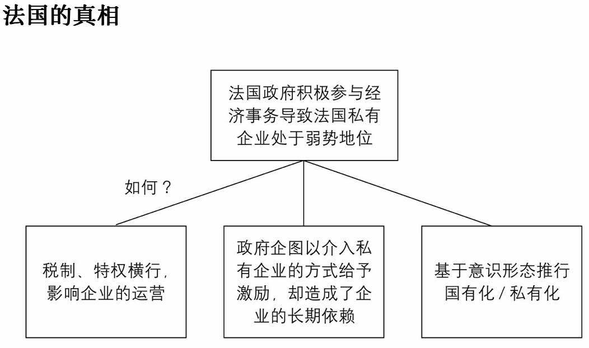
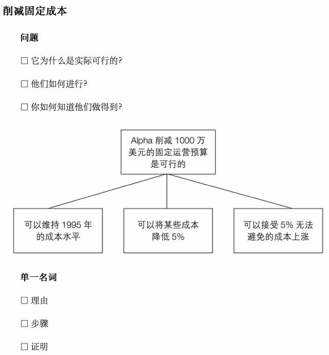

# 金字塔原理2-实战篇(第2篇): 金字塔内部结构

<!-- START doctoc generated TOC please keep comment here to allow auto update -->
<!-- DON'T EDIT THIS SECTION, INSTEAD RE-RUN doctoc TO UPDATE -->
<!-- **Table of Contents**  *generated with [DocToc](https://github.com/thlorenz/doctoc)*-->

- [金字塔原理2-实战篇(第2篇): 金字塔内部结构](#%E9%87%91%E5%AD%97%E5%A1%94%E5%8E%9F%E7%90%862-%E5%AE%9E%E6%88%98%E7%AF%87%E7%AC%AC2%E7%AF%87-%E9%87%91%E5%AD%97%E5%A1%94%E5%86%85%E9%83%A8%E7%BB%93%E6%9E%84)
- [练习2：建立纵向关系](#%E7%BB%83%E4%B9%A02%E5%BB%BA%E7%AB%8B%E7%BA%B5%E5%90%91%E5%85%B3%E7%B3%BB)
  - [2.1 引导纵向的“疑问——回答”式对话](#21-%E5%BC%95%E5%AF%BC%E7%BA%B5%E5%90%91%E7%9A%84%E7%96%91%E9%97%AE%E5%9B%9E%E7%AD%94%E5%BC%8F%E5%AF%B9%E8%AF%9D)
    - [练习2-1：太平洋的亚洲](#%E7%BB%83%E4%B9%A02-1%E5%A4%AA%E5%B9%B3%E6%B4%8B%E7%9A%84%E4%BA%9A%E6%B4%B2)
    - [练习2-2：量产公司](#%E7%BB%83%E4%B9%A02-2%E9%87%8F%E4%BA%A7%E5%85%AC%E5%8F%B8)
    - [练习2-3：家庭体系](#%E7%BB%83%E4%B9%A02-3%E5%AE%B6%E5%BA%AD%E4%BD%93%E7%B3%BB)
    - [练习2-4：日渐增加的竞争](#%E7%BB%83%E4%B9%A02-4%E6%97%A5%E6%B8%90%E5%A2%9E%E5%8A%A0%E7%9A%84%E7%AB%9E%E4%BA%89)
    - [练习2-5：革命](#%E7%BB%83%E4%B9%A02-5%E9%9D%A9%E5%91%BD)
    - [练习2-6：混沌的开始](#%E7%BB%83%E4%B9%A02-6%E6%B7%B7%E6%B2%8C%E7%9A%84%E5%BC%80%E5%A7%8B)
- [练习3：建立横向关系](#%E7%BB%83%E4%B9%A03%E5%BB%BA%E7%AB%8B%E6%A8%AA%E5%90%91%E5%85%B3%E7%B3%BB)
  - [3.1 找出横向的逻辑](#31-%E6%89%BE%E5%87%BA%E6%A8%AA%E5%90%91%E7%9A%84%E9%80%BB%E8%BE%91)
    - [(1) 演绎推理中第二段：是对第一段主语/谓语的评论](#1-%E6%BC%94%E7%BB%8E%E6%8E%A8%E7%90%86%E4%B8%AD%E7%AC%AC%E4%BA%8C%E6%AE%B5%E6%98%AF%E5%AF%B9%E7%AC%AC%E4%B8%80%E6%AE%B5%E4%B8%BB%E8%AF%AD%E8%B0%93%E8%AF%AD%E7%9A%84%E8%AF%84%E8%AE%BA)
      - [练习3A-1：三段式演绎推理](#%E7%BB%83%E4%B9%A03a-1%E4%B8%89%E6%AE%B5%E5%BC%8F%E6%BC%94%E7%BB%8E%E6%8E%A8%E7%90%86)
      - [练习3A-2：四段式演绎推理](#%E7%BB%83%E4%B9%A03a-2%E5%9B%9B%E6%AE%B5%E5%BC%8F%E6%BC%94%E7%BB%8E%E6%8E%A8%E7%90%86)
      - [练习3A-3：提取文字中的演绎推理逻辑](#%E7%BB%83%E4%B9%A03a-3%E6%8F%90%E5%8F%96%E6%96%87%E5%AD%97%E4%B8%AD%E7%9A%84%E6%BC%94%E7%BB%8E%E6%8E%A8%E7%90%86%E9%80%BB%E8%BE%91)
      - [3A-3-1 轶事为论点的一部分](#3a-3-1-%E8%BD%B6%E4%BA%8B%E4%B8%BA%E8%AE%BA%E7%82%B9%E7%9A%84%E4%B8%80%E9%83%A8%E5%88%86)
      - [3A-3-2 暗示的观点](#3a-3-2-%E6%9A%97%E7%A4%BA%E7%9A%84%E8%A7%82%E7%82%B9)
      - [3A-3-3 连环式的观点、顺序颠倒](#3a-3-3-%E8%BF%9E%E7%8E%AF%E5%BC%8F%E7%9A%84%E8%A7%82%E7%82%B9%E9%A1%BA%E5%BA%8F%E9%A2%A0%E5%80%92)
      - [3A-3-4 连环式/暗示/重复颠倒/无法令人信服的观点](#3a-3-4-%E8%BF%9E%E7%8E%AF%E5%BC%8F%E6%9A%97%E7%A4%BA%E9%87%8D%E5%A4%8D%E9%A2%A0%E5%80%92%E6%97%A0%E6%B3%95%E4%BB%A4%E4%BA%BA%E4%BF%A1%E6%9C%8D%E7%9A%84%E8%A7%82%E7%82%B9)
    - [(2) 演绎推理摘要](#2-%E6%BC%94%E7%BB%8E%E6%8E%A8%E7%90%86%E6%91%98%E8%A6%81)
      - [要点](#%E8%A6%81%E7%82%B9)
      - [练习3A-7：西窗](#%E7%BB%83%E4%B9%A03a-7%E8%A5%BF%E7%AA%97)
      - [练习3A-8：垄断法](#%E7%BB%83%E4%B9%A03a-8%E5%9E%84%E6%96%AD%E6%B3%95)
    - [(3) 归纳推理](#3-%E5%BD%92%E7%BA%B3%E6%8E%A8%E7%90%86)
      - [要点：找出提到的问题以及单一名词](#%E8%A6%81%E7%82%B9%E6%89%BE%E5%87%BA%E6%8F%90%E5%88%B0%E7%9A%84%E9%97%AE%E9%A2%98%E4%BB%A5%E5%8F%8A%E5%8D%95%E4%B8%80%E5%90%8D%E8%AF%8D)
      - [练习3B-1：信息系统的应用](#%E7%BB%83%E4%B9%A03b-1%E4%BF%A1%E6%81%AF%E7%B3%BB%E7%BB%9F%E7%9A%84%E5%BA%94%E7%94%A8)
      - [练习3B-2：Prestel咨询系统](#%E7%BB%83%E4%B9%A03b-2prestel%E5%92%A8%E8%AF%A2%E7%B3%BB%E7%BB%9F)
      - [练习3B-3：执行计划](#%E7%BB%83%E4%B9%A03b-3%E6%89%A7%E8%A1%8C%E8%AE%A1%E5%88%92)
      - [练习3B-4：内部业务合法化](#%E7%BB%83%E4%B9%A03b-4%E5%86%85%E9%83%A8%E4%B8%9A%E5%8A%A1%E5%90%88%E6%B3%95%E5%8C%96)
      - [练习3B-5：消减固定成本](#%E7%BB%83%E4%B9%A03b-5%E6%B6%88%E5%87%8F%E5%9B%BA%E5%AE%9A%E6%88%90%E6%9C%AC)
      - [练习3B-6:  基金投资提案](#%E7%BB%83%E4%B9%A03b-6--%E5%9F%BA%E9%87%91%E6%8A%95%E8%B5%84%E6%8F%90%E6%A1%88)
      - [练习3B-7：合格供货商](#%E7%BB%83%E4%B9%A03b-7%E5%90%88%E6%A0%BC%E4%BE%9B%E8%B4%A7%E5%95%86)
    - [(4) 归纳推理摘要](#4-%E5%BD%92%E7%BA%B3%E6%8E%A8%E7%90%86%E6%91%98%E8%A6%81)
      - [练习3B-8-1：谓语相同、主语属于同一范畴](#%E7%BB%83%E4%B9%A03b-8-1%E8%B0%93%E8%AF%AD%E7%9B%B8%E5%90%8C%E4%B8%BB%E8%AF%AD%E5%B1%9E%E4%BA%8E%E5%90%8C%E4%B8%80%E8%8C%83%E7%95%B4)
      - [练习3B-8-2：主语相同、谓语属于同一范畴](#%E7%BB%83%E4%B9%A03b-8-2%E4%B8%BB%E8%AF%AD%E7%9B%B8%E5%90%8C%E8%B0%93%E8%AF%AD%E5%B1%9E%E4%BA%8E%E5%90%8C%E4%B8%80%E8%8C%83%E7%95%B4)
      - [练习3B-8-3：从隐含结论中寻找相似之处](#%E7%BB%83%E4%B9%A03b-8-3%E4%BB%8E%E9%9A%90%E5%90%AB%E7%BB%93%E8%AE%BA%E4%B8%AD%E5%AF%BB%E6%89%BE%E7%9B%B8%E4%BC%BC%E4%B9%8B%E5%A4%84)
    - [(5) 爱是一种错误：金字塔结构在文学作品中的应用](#5-%E7%88%B1%E6%98%AF%E4%B8%80%E7%A7%8D%E9%94%99%E8%AF%AF%E9%87%91%E5%AD%97%E5%A1%94%E7%BB%93%E6%9E%84%E5%9C%A8%E6%96%87%E5%AD%A6%E4%BD%9C%E5%93%81%E4%B8%AD%E7%9A%84%E5%BA%94%E7%94%A8)

<!-- END doctoc generated TOC please keep comment here to allow auto update -->

# 练习2：建立纵向关系

## 2.1 引导纵向的“疑问——回答”式对话

~~~txt
纵向结构：用“疑问”——“回答”的方式让读者跟紧思路
横向结构：用演绎或归纳推理的形式回答 
~~~

写下自己观点时，就要在读者心中引起一个疑问

### 练习2-1：太平洋的亚洲

原文

~~~txt
想要在印度经商的跨国企业，现在除了要制订各种项目计划外，还要创造有利于印度与全球经济整合的社会与政治环境。首先，企业应该与有竞争力的印度合伙人合作。其次，要更加注意和当地及省级官员建立良好的关系——不能单纯依靠中央政府的保证。再次，企业应该以光明正大且具有竞争力的方式参与公共建设。最后，企业可能需要赞助当地的健康和教育计划以获取民众支持。
~~~

建立纵向结构

### 练习2-2：量产公司

原文

~~~txt
大批量生产必须由大型企业进行，而且正是这些大型企业引领了美国的成长。这些大型企业一般都有影响市场的能力，懂得运用规模经济，这也是提升美国成长力的基础。大型企业还有其他贡献。一般规模庞大、经营较为稳定的量产企业都会积极投资昂贵的设备、研发新的科技。比如说，1880～1900年，安德鲁·卡内基公司的投资额提高了10倍。还有柯达，早在19世纪80年代就开始投入研发。在第二次世界大战之后，规模庞大的私人公司，包括贝尔实验室、IBM和西屋公司，也带来了许多重要的科学突破。

大型企业通常拥有庞大、稳定的工作团队。企业会为员工支付相对较高的薪资。当这些企业的工会获得大量利益之后，会影响全美国其他企业的薪资水平。研究显示，与小型企业相比，大企业一般会有比较好的员工福利。而且大型企业具有更强大的创新能力，会更积极地在创新方面进行投资。
~~~

建立纵向结构

### 练习2-3：家庭体系

原文

~~~txt
在一些亚洲国家，强大的家庭体系被视为对抗外在威胁与恶劣环境的基本防御机制。农民只相信自己的家人，因为家庭以外的人——各级官员和士绅——不见得多有善意，甚至会巧取豪夺。大部分农民家庭挣扎在温饱线上，很少有余力可以救助朋友或邻居。有了孩子之后，儿女就成了必要的帮手，同时还可以给父母养老送终。在这样艰难的情形下，自给自足的家庭就成了唯一能提供庇护与支持的地方。
~~~

建立纵向结构

### 练习2-4：日渐增加的竞争

原文

~~~txt
外国公司更具弹性的生产模式，以及分散在各地的市场等让竞争日趋激烈，使得美国的产业环境急剧变化。而美国人对这个现象的反应比欧洲还要保守，这不是没有理由的。

首先，美国拥有福特生产方式（Fordism），对于新的生产模式并不抱太多信心，一开始就不太重视、不愿意运用（也许大部分美国公司和我们一样），所以在投资新的生产模式上反应比较慢。美国公司更强调降低成本，以维持低廉的商品价格，而非投资新的生产模式。研究显示，即使美国公司买了新的计算机设备，通常也是用来提高产量、降低单位成本的，而不是像日本和欧洲公司那样，生产的产品数量越来越少，但更倾向于为顾客量身打造。

其次，美国企业注重获利，一旦回报率下降，就更不愿意在基本建设项目上投资了。相比之下，当利润和回报率下降时，日本和德国企业的投资意愿就要高于美国企业。

最后，美国的产能过剩问题比其他国家出现得早，有闲置产能的公司在投资上趋于保守也是可以理解的。

因此，美国会比其他国家更倾向于减少投资。即使在1993～1994年投资额增加，其幅度也不及20世纪五六十年代的水平，而现在也不确定会继续保持相对较高的资本投资。1994年，美国的净投资额大约只占国民生产总值的3%，而在20世纪五六十年代则占国民生产总值的7%～8%。
~~~

建立纵向结构

### 练习2-5：革命

原文

~~~txt
早期那些提出混沌理论的人曾经很痛苦，因为他们不知道如何将自己的思想和研究结果公之于世。因为这一理论难以归于任何一门现有的学科。比如说，对物理学者而言太抽象，但对数学家而言实验性又太明显。对某些人来说，在宣传新观点的时候，遇到的困难有多大，遭到的质疑有多激烈，就说明这种新理论是多么具有革命性。肤浅的观点通常容易被接受，而一种需要人们重新架构世界观的新观点，却会引起敌意。

在乔治亚理工学院，有一位物理学者——约瑟夫·福特，他引用了托尔斯泰的一句话：“我知道大部分人，包括那些面对最复杂的问题也能轻松解决的人，很少会接受最简单和最明白的真理，因为这些真理让他们不得不承认自己的错误，而这些错误正好是他们曾经很高兴地向其他人讲述的观点，他们曾经很得意地以此教导别人。”
~~~

建立纵向结构

### 练习2-6：混沌的开始

原文

~~~txt
夜晚，你不妨站在海滩上，看那月光映照在水面，你可以感觉到月亮在牵引着潮汐，或许你也会联想到，月亮的形成可能与地球上的大潮汐有关，它从地球上分离出去被抛到外层空间。如果月亮真的是这样形成的，可能就与我们所知道的海中盆地和大陆的形成有关。

地球的潮汐现象早在海洋出现之前就已经存在。那时，由于太阳的牵引，地球的整个表面满是流动的岩浆，之后，岩浆的运动逐渐减缓，终至冷却、凝固和结块。相信月亮曾是地球一部分的人认为，在地球形成的早期发生了一些事，让流动的岩浆获得了加速的动能，使其温度升高到令人难以想象的地步。

太阳的牵引力使地球产生了潮汐运动，地球的旋转作用与太阳的潮汐作用产生共振，为地球的自转增加了动能。于是，地球的自转速度不断加快，每一次潮汐运动都比前一次更强。

物理学者曾经计算过，经过500多年大规模稳定增强的潮汐运动之后，在面向太阳一侧的地球赤道，熔融物质会出现膨胀区，于是一次大浪把一团熔融物质甩到了星际空间中。这颗刚形成的卫星遵循物理定律，围绕着地球旋转。这就是月亮诞生的一个假说。
~~~

建立纵向结构

# 练习3：建立横向关系

## 3.1 找出横向的逻辑

横向逻辑有两种展开方式

推理演绎

~~~txt
第一个观点：大前提
第二个观点：小前提（大前提的特殊陈述）
第三个观点：两个前提同时满足得到的推论
~~~

归纳推理

~~~txt
步骤1：各个观点说的都是同一件事（相同主题/内容）
步骤2：都可以用同一个名词来描述（例如理由、问题、步骤）
步骤3：概括出他们的共性作为结论
~~~

### (1) 演绎推理中第二段：是对第一段主语/谓语的评论

演绎推理可以是三段式的，也可以是四段式的连环推理。

演绎推理时，通常在第二个观点中、对第一个观点进行评论，并随后的出“因此”的结论

#### 练习3A-1：三段式演绎推理

第二个方框评论了第一个方框的主语或谓语，请写出具体是什么

#### 练习3A-2：四段式演绎推理

第二、第三个方框评论了第一个方框的主语或谓语，请写出具体是什么

#### 练习3A-3：提取文字中的演绎推理逻辑

#### 3A-3-1 轶事为论点的一部分

原文：新的领域

~~~txt
我又一次深刻地感受到，要一个人放弃他科学研究的理论基础是多么困难。为了探索客观物理世界在时空中运行的法则，爱因斯坦奉献了毕生的精力。理论物理学中的数学符号也是这个客观物理世界的表征，借助这符号，杰出的物理学者得以描绘客观世界未来的走向。现在已经可以确定，时空中的客观世界并不存在，而理论物理学中的数学符号所表述的可能性反而较为真实。

爱因斯坦不会让人们破坏他的研究基础。当量子力学变成现代物理学不可缺少的部分时，爱因斯坦也没有改变态度——他只能将量子力学作为一个假说勉强接受。“上帝不会掷骰子。”这是他坚持的原则，他不会让任何人挑战这一点，所以波尔只能说：“指导上帝如何掌管世界不是我们的责任。”
~~~

逻辑提取

#### 3A-3-2 暗示的观点

原文：无摩擦经济

~~~txt
美国人因为五角大楼为铁锤支付300美元、为一套马桶花费800美元要求启动调查，这要追溯到20世纪80年代对国防合约体系的不信任。国防合约是一项特殊的经济活动，因为许多武器都是独一无二的商品。它们很少有商业上的竞争品，因此它们的价格必须经谈判确定，以成本加成为基础，而非市场行情。在这个体系之下，在签订合约时，无论是承包商还是政府官员，都有可操作的空间，而且经常有舞弊现象发生。

处理这个问题的方法之一是简化手续，在五角大楼内选择可以信赖的主要官员，运用他们的判断力来签订合理的采购合约。这样做可能需要忍受官员们偶然会出现的判断失误和丑闻，这就像经营企业付出的成本一样。事实上，对于特别重要的武器，已经成功建立了这样的采购模式。但是在一般的例行采购中，仍存在双方对彼此的不信任——承包商会想尽办法欺骗纳税人，而那些尽可能谨慎地与承包商往来的政府官员也有可能滥用职权。因此，采购费用必须经过多级文件申请，以获得审批。如此一来，承包商和政府官员便要层层雇用审计人员进行追踪与记录。所有这些都给政府采购带来了庞大的额外交易成本，这就是军事采购价格如此高昂的最主要的原因。
~~~

逻辑提取

#### 3A-3-3 连环式的观点、顺序颠倒 

原文：知识的矛盾性

~~~txt
知识已经变成一种新的财产形式，获得专业知识以及运用这些知识和技术的能力是新的财富来源。

新加坡人称自己的国家为知识岛，他们发现，传统的财富来源和相对优势（土地、原料、金钱和科技）在具备了知识和技术的情况下，全都可以买到。新加坡和中国香港都已经将所有的制造活动转移到苏门答腊、菲律宾和中国广东省等人工成本低廉的地区，但管理总部、设计和营销部门（也就是知识密集型的部门）仍保留在公司总部所在地。

对新加坡有效的发展经验对其他各国也应有效。因为新的社会财富来源是知识，知识是新的财产形式。然而，知识与其他形式的财产不同，其中存在一些矛盾的现象。举例来说，以法律裁决的形式给予人们知识或是重新分配知识是不可能的；当一个人离开人世的时候，要将他的知识留给孩子也是不可能的。另外，接受教育是一个人将来是否富有的关键，然而这需要花费很长时间。知识很神奇，即使我与你分享知识或专业技能，我也仍然能完整地拥有它。要从任何人身上取走这种新形式的财产都是不可能的。

知识具有不易脱离的特性，拥有别人的知识也是不可能的。管理学大师彼得·德鲁克（PeterDrucker）说得对——生产工具实际上已经不再为那些企业家所专有。拥有知识的人若想离开，要阻止他们是很困难的。购买微软这类公司的股票是一种赌博，因为其前提是员工所拥有的知识会继续留在公司，而且这些知识永不会消失。就股票市场而言，知识是一种不安全因素，是一种有漏洞的资产。

更复杂的是，知识难以衡量，这就是知识产权很少在资产负债表上出现的原因。而且它也让征税变得更加困难，它不像任何其他形式的财产那样方便纳税。

幸运的是，虽然无法用行政命令重新分配知识，但也无法阻止人们获取知识。理论上，任何人都有可能以某种形式拥有知识，并且因此得到权力与财富。如果不是因为知识，我们很难想象小公司怎样与微软这样的大公司角力，就如同当初的微软之于IBM。然而，当公司的主要财产是知识时，这种角力便成了可能。由知识决定的市场是一个门槛相对较低的市场，因此会让社会更加开放。

知识会向知识集中的地方流动。接受过良好教育的人会给他们的孩子提供良好的教育，让他们获得权力与财富。因此，这种新形式的财产还有可能使社会逐渐分裂，除非我们把整个社会转变成一个永久学习型社会。在其中，每个人都能热切追寻更多的知识，就像他们现在追寻属于自己的家一样。
~~~

逻辑提取

#### 3A-3-4 连环式/暗示/重复颠倒/无法令人信服的观点

原文：功能性的下层社会

~~~txt
下层社会的存在是被普遍接受的事实，但令人无法接受且很少被人提及的是，下层社会其实是社会经济活动中的一环，更重要的是，它是确保优势群体生活水平和舒适度的基础。下层社会的生活主要是功能性的，所有工业国家都有一定比例的、以各种形式存在的下层社会。一些下层社会的人试图摆脱被剥削和被压迫的处境，这时市场供需的改变便成了必要的手段。

要了解这一现实，可以从大众对工作的定义开始。传统看法认为，工作是愉快且有回报的，不同的职业可以获得不同程度的快乐，一个正常的人会以他的工作为荣。

但实际上，很多工作是重复性的，很沉闷，让人感到痛苦和疲劳，在心理上感觉无聊或是社会地位低下。比如，各种消费服务者与家庭劳务服务者，还包括农民、工业生产流水线上的工人，在这些工作中，人工工资成了影响成本的主要因素，因而直接决定商品价格的变化。只有人工成本和价格之间的联系被打破，或是部分脱钩（这当然是较高社会阶层才会有的现象），工作才会变成让人愉快的事，人们才能享受工作的乐趣。在现代经济制度中，很少有人提出一个基本但又很重要的现象：最高的薪酬往往对应那些最有名望、令人愉快的工作。相反，那些令人不快的工作，让人直接接受另外一个人的命令的工作，比如门房、保姆，还有清洁工、垃圾回收工、警卫、电梯小姐等，这些工作都有一个共同点——社会地位低下。

“工作”一词，对某些人而言意味着沉闷、痛苦或是身份低微，对另一些人而言却是愉快、有名望以及丰厚的经济回报。在现代社会的种种假象（甚至是欺诈）中，没有比这更夸张的了。那些工作愉悦、报酬高的人强调，他们确实很努力，希望借此掩饰他们获得利益的事实。他们当然可以说自己很享受工作，并由此认定所有好工人也跟自己一样。然而想想看，当宣判犯人的刑期时，常常会同时让犯人做几年的“苦工”，所以这类工作本质上是种惩罚。我们多多少少都在掩盖愉快的工作和需要人忍耐或感到痛苦的工作之间的差异。

由上述内容可以得到一个事实：在现代经济社会中，贫穷的人必须去做那些比较幸运的人不愿做的工作，而且这些工作明显让人生厌，甚至是痛苦。然而，社会总是需要这些为生活提供最基础保障的工作者。
~~~

逻辑提取

### (2) 演绎推理摘要

#### 要点

用途：为文章提供基础、让后续的思想进一步发展

要点：应该包含其中的所有论点（不是单单重复“因此”这一个观点）

方法：

1. 把最后得到的观点（C）放在最上层，加上一个“因为”，涵盖其它两个论点（A、B），进而得到初步的“大纲式摘要”（D）
2. 这个版本还不够简介，对其进行改写，让论述流畅优美（E）。这个句子可以用于衔接后文继续展开论述

例子

#### 练习3A-7：西窗

#### 练习3A-8：垄断法

### (3) 归纳推理

#### 要点：找出提到的问题以及单一名词

1. 一般会列出3-4个相近观点、用一归纳出新的观点
2. 各组观点可用单一名词描述

| 问题       | 单一名词 |
| ---------- | -------- |
| 为什么     | 理由     |
| 如何       | 步骤     |
| 你如何知道 | 证明     |

#### 练习3B-1：信息系统的应用

#### 练习3B-2：Prestel咨询系统

#### 练习3B-3：执行计划

#### 练习3B-4：内部业务合法化

#### 练习3B-5：消减固定成本

#### 练习3B-6:  基金投资提案

#### 练习3B-7：合格供货商

### (4) 归纳推理摘要

做摘要的过程、也就是完成推论的过程。方法是：把所有思想都写成主语和谓语的句子，出现以下情形说明这组思想存在相似点

| 相同部分     | 相似部分                 | 方法                             |
| ------------ | ------------------------ | -------------------------------- |
| 主语相同     | 且谓语属于同一范畴       | 从谓语中提取相似点、得到推论     |
| 谓语相同     | 且主语属于同一范畴       | 从主语中提取相似点、得到推论     |
| 主谓都不相同 | 但隐含意思出属于同一范畴 | 从隐含意思中提取相似点、得到推论 |

#### 练习3B-8-1：谓语相同、主语属于同一范畴

谓语都是“投资中国”，寻找主语中的相似点。主语中的三个国家都是“当今世界上的经济强国”，由此得出推论“经验丰富的投资者正涌向中国”

#### 练习3B-8-2：主语相同、谓语属于同一范畴

主语都是“日本商人”，寻找谓语中的相似点。谓语三个国家都谓语太平洋地区，得到推论“日本商人对太平洋地区的兴趣正在逐渐提升“

#### 练习3B-8-3：从隐含结论中寻找相似之处

| 主语     | 谓语                   | 隐含结论                           |
| -------- | ---------------------- | ---------------------------------- |
| 没有专人 | 负责管理档案           | 不重要（不看重档案管理）           |
| 分享信息 | 需要改变               | 很难执行（没有尝试改变的动力）     |
| 公司     | 不了解文件归档所需成本 | 不重要（公司连成本都不去了解）     |
| 电子存档 | 公司需要改变运营理念   | 很难执行（一直都没有接受新的理念） |

于是得出结论：公司不可能采用电子存档，因为没有人认为存档重要，员工也不愿意改变工作方式以配合这套系统

### (5) 爱是一种错误：金字塔结构在文学作品中的应用

书中提供了一个例子，遵循金字塔结构来撰写文学作品。它采用如下的架构来写故事

1. 出现了一个事件
2. 产生冲突
3. 找到解决的方法

