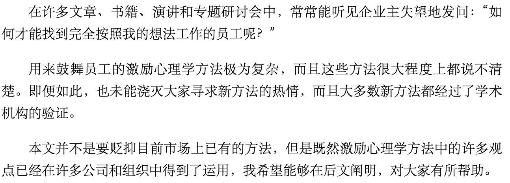
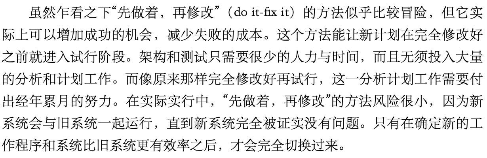

# 金字塔原理2-实战篇(第3篇): 构建金字塔

<!-- START doctoc generated TOC please keep comment here to allow auto update -->
<!-- DON'T EDIT THIS SECTION, INSTEAD RE-RUN doctoc TO UPDATE -->
<!-- **Table of Contents**  *generated with [DocToc](https://github.com/thlorenz/doctoc)*-->

- [练习4：序言的写法](#%E7%BB%83%E4%B9%A04%E5%BA%8F%E8%A8%80%E7%9A%84%E5%86%99%E6%B3%95)
  - [4.1 决定读者遇到的第一个问题](#41-%E5%86%B3%E5%AE%9A%E8%AF%BB%E8%80%85%E9%81%87%E5%88%B0%E7%9A%84%E7%AC%AC%E4%B8%80%E4%B8%AA%E9%97%AE%E9%A2%98)
    - [4.1.1 写序言的要点](#411-%E5%86%99%E5%BA%8F%E8%A8%80%E7%9A%84%E8%A6%81%E7%82%B9)
    - [4.1.2 熟悉序言的结构](#412-%E7%86%9F%E6%82%89%E5%BA%8F%E8%A8%80%E7%9A%84%E7%BB%93%E6%9E%84)
      - [练习4A1：资本投资的风险分析](#%E7%BB%83%E4%B9%A04a1%E8%B5%84%E6%9C%AC%E6%8A%95%E8%B5%84%E7%9A%84%E9%A3%8E%E9%99%A9%E5%88%86%E6%9E%90)
      - [练习4A2：再一次讨论：如何激励员工](#%E7%BB%83%E4%B9%A04a2%E5%86%8D%E4%B8%80%E6%AC%A1%E8%AE%A8%E8%AE%BA%E5%A6%82%E4%BD%95%E6%BF%80%E5%8A%B1%E5%91%98%E5%B7%A5)
      - [练习4A3：目光短浅的市场营销](#%E7%BB%83%E4%B9%A04a3%E7%9B%AE%E5%85%89%E7%9F%AD%E6%B5%85%E7%9A%84%E5%B8%82%E5%9C%BA%E8%90%A5%E9%94%80)
      - [练习4A4：生态保护和经济发展：结束困境](#%E7%BB%83%E4%B9%A04a4%E7%94%9F%E6%80%81%E4%BF%9D%E6%8A%A4%E5%92%8C%E7%BB%8F%E6%B5%8E%E5%8F%91%E5%B1%95%E7%BB%93%E6%9D%9F%E5%9B%B0%E5%A2%83)
    - [4.1.3. 从文字中找出序言结构](#413-%E4%BB%8E%E6%96%87%E5%AD%97%E4%B8%AD%E6%89%BE%E5%87%BA%E5%BA%8F%E8%A8%80%E7%BB%93%E6%9E%84)
      - [练习4A5：董事会的任务](#%E7%BB%83%E4%B9%A04a5%E8%91%A3%E4%BA%8B%E4%BC%9A%E7%9A%84%E4%BB%BB%E5%8A%A1)
      - [练习4A6：远离日本市场](#%E7%BB%83%E4%B9%A04a6%E8%BF%9C%E7%A6%BB%E6%97%A5%E6%9C%AC%E5%B8%82%E5%9C%BA)
      - [练习4A7：电视收视率的下降](#%E7%BB%83%E4%B9%A04a7%E7%94%B5%E8%A7%86%E6%94%B6%E8%A7%86%E7%8E%87%E7%9A%84%E4%B8%8B%E9%99%8D)
      - [练习4A8：欲速则不达](#%E7%BB%83%E4%B9%A04a8%E6%AC%B2%E9%80%9F%E5%88%99%E4%B8%8D%E8%BE%BE)
      - [练习4A9：美国的发展史](#%E7%BB%83%E4%B9%A04a9%E7%BE%8E%E5%9B%BD%E7%9A%84%E5%8F%91%E5%B1%95%E5%8F%B2)
      - [练习4A10：校园内的自重](#%E7%BB%83%E4%B9%A04a10%E6%A0%A1%E5%9B%AD%E5%86%85%E7%9A%84%E8%87%AA%E9%87%8D)
  - [4.2 自选练习](#42-%E8%87%AA%E9%80%89%E7%BB%83%E4%B9%A0)
    - [4.2.1 从多段文字中找出序言结构](#421-%E4%BB%8E%E5%A4%9A%E6%AE%B5%E6%96%87%E5%AD%97%E4%B8%AD%E6%89%BE%E5%87%BA%E5%BA%8F%E8%A8%80%E7%BB%93%E6%9E%84)
      - [练习4B1：产品管理的回报](#%E7%BB%83%E4%B9%A04b1%E4%BA%A7%E5%93%81%E7%AE%A1%E7%90%86%E7%9A%84%E5%9B%9E%E6%8A%A5)
      - [练习4B2：客户与顾问的关系](#%E7%BB%83%E4%B9%A04b2%E5%AE%A2%E6%88%B7%E4%B8%8E%E9%A1%BE%E9%97%AE%E7%9A%84%E5%85%B3%E7%B3%BB)
      - [练习4B3：科学的独特性](#%E7%BB%83%E4%B9%A04b3%E7%A7%91%E5%AD%A6%E7%9A%84%E7%8B%AC%E7%89%B9%E6%80%A7)
      - [练习4B4：医疗科技](#%E7%BB%83%E4%B9%A04b4%E5%8C%BB%E7%96%97%E7%A7%91%E6%8A%80)
      - [练习4B5：电视影像的问题出在哪](#%E7%BB%83%E4%B9%A04b5%E7%94%B5%E8%A7%86%E5%BD%B1%E5%83%8F%E7%9A%84%E9%97%AE%E9%A2%98%E5%87%BA%E5%9C%A8%E5%93%AA)
    - [4.2.2 序言模版](#422-%E5%BA%8F%E8%A8%80%E6%A8%A1%E7%89%88)
      - [(1) 商业文件](#1-%E5%95%86%E4%B8%9A%E6%96%87%E4%BB%B6)
      - [(2) 咨询文件](#2-%E5%92%A8%E8%AF%A2%E6%96%87%E4%BB%B6)
- [练习5：构建自己的金字塔](#%E7%BB%83%E4%B9%A05%E6%9E%84%E5%BB%BA%E8%87%AA%E5%B7%B1%E7%9A%84%E9%87%91%E5%AD%97%E5%A1%94)
  - [5.1 套用“背景-冲突-问题”模式](#51-%E5%A5%97%E7%94%A8%E8%83%8C%E6%99%AF-%E5%86%B2%E7%AA%81-%E9%97%AE%E9%A2%98%E6%A8%A1%E5%BC%8F)
    - [5.1.1 步骤](#511-%E6%AD%A5%E9%AA%A4)
    - [5.1.2 构建金字塔（例子5A）](#512-%E6%9E%84%E5%BB%BA%E9%87%91%E5%AD%97%E5%A1%94%E4%BE%8B%E5%AD%905a)
      - [(1) 步骤1：画出方框并填入主题](#1-%E6%AD%A5%E9%AA%A41%E7%94%BB%E5%87%BA%E6%96%B9%E6%A1%86%E5%B9%B6%E5%A1%AB%E5%85%A5%E4%B8%BB%E9%A2%98)
      - [(2) 步骤2：找出完整的序言概要](#2-%E6%AD%A5%E9%AA%A42%E6%89%BE%E5%87%BA%E5%AE%8C%E6%95%B4%E7%9A%84%E5%BA%8F%E8%A8%80%E6%A6%82%E8%A6%81)
      - [(3) 步骤3:  找出关键句](#3-%E6%AD%A5%E9%AA%A43--%E6%89%BE%E5%87%BA%E5%85%B3%E9%94%AE%E5%8F%A5)
      - [(4) 步骤4：构建次级观点的金字塔结构](#4-%E6%AD%A5%E9%AA%A44%E6%9E%84%E5%BB%BA%E6%AC%A1%E7%BA%A7%E8%A7%82%E7%82%B9%E7%9A%84%E9%87%91%E5%AD%97%E5%A1%94%E7%BB%93%E6%9E%84)
    - [5.1.3 例子演示](#513-%E4%BE%8B%E5%AD%90%E6%BC%94%E7%A4%BA)
      - [练习5A-1：合理化计划](#%E7%BB%83%E4%B9%A05a-1%E5%90%88%E7%90%86%E5%8C%96%E8%AE%A1%E5%88%92)
      - [练习5A-2：钻探甲烷](#%E7%BB%83%E4%B9%A05a-2%E9%92%BB%E6%8E%A2%E7%94%B2%E7%83%B7)
  - [5.2 更多构建金字塔结构的练习](#52-%E6%9B%B4%E5%A4%9A%E6%9E%84%E5%BB%BA%E9%87%91%E5%AD%97%E5%A1%94%E7%BB%93%E6%9E%84%E7%9A%84%E7%BB%83%E4%B9%A0)
    - [5.2.1 找出背景/冲突/问题以及次级观点关键句，构建金字塔结构](#521-%E6%89%BE%E5%87%BA%E8%83%8C%E6%99%AF%E5%86%B2%E7%AA%81%E9%97%AE%E9%A2%98%E4%BB%A5%E5%8F%8A%E6%AC%A1%E7%BA%A7%E8%A7%82%E7%82%B9%E5%85%B3%E9%94%AE%E5%8F%A5%E6%9E%84%E5%BB%BA%E9%87%91%E5%AD%97%E5%A1%94%E7%BB%93%E6%9E%84)
      - [练习5B-1：PAGAM资产处理费用](#%E7%BB%83%E4%B9%A05b-1pagam%E8%B5%84%E4%BA%A7%E5%A4%84%E7%90%86%E8%B4%B9%E7%94%A8)
      - [练习5B-2：TRW信息系统事业小组](#%E7%BB%83%E4%B9%A05b-2trw%E4%BF%A1%E6%81%AF%E7%B3%BB%E7%BB%9F%E4%BA%8B%E4%B8%9A%E5%B0%8F%E7%BB%84)
      - [练习5B-3：供货商资格、评鉴和开发](#%E7%BB%83%E4%B9%A05b-3%E4%BE%9B%E8%B4%A7%E5%95%86%E8%B5%84%E6%A0%BC%E8%AF%84%E9%89%B4%E5%92%8C%E5%BC%80%E5%8F%91)
      - [练习5B-4：A.B.工业公司的采购作业](#%E7%BB%83%E4%B9%A05b-4ab%E5%B7%A5%E4%B8%9A%E5%85%AC%E5%8F%B8%E7%9A%84%E9%87%87%E8%B4%AD%E4%BD%9C%E4%B8%9A)
      - [练习5B-5：报废资产申报系统建议方案](#%E7%BB%83%E4%B9%A05b-5%E6%8A%A5%E5%BA%9F%E8%B5%84%E4%BA%A7%E7%94%B3%E6%8A%A5%E7%B3%BB%E7%BB%9F%E5%BB%BA%E8%AE%AE%E6%96%B9%E6%A1%88)
      - [练习5B-6：现场销售会议](#%E7%BB%83%E4%B9%A05b-6%E7%8E%B0%E5%9C%BA%E9%94%80%E5%94%AE%E4%BC%9A%E8%AE%AE)
    - [5.2.2 根据论点而非类别构建金字塔结构](#522-%E6%A0%B9%E6%8D%AE%E8%AE%BA%E7%82%B9%E8%80%8C%E9%9D%9E%E7%B1%BB%E5%88%AB%E6%9E%84%E5%BB%BA%E9%87%91%E5%AD%97%E5%A1%94%E7%BB%93%E6%9E%84)
      - [(1) 逻辑不清晰的文章](#1-%E9%80%BB%E8%BE%91%E4%B8%8D%E6%B8%85%E6%99%B0%E7%9A%84%E6%96%87%E7%AB%A0)
      - [(2) 错误的金字塔结构](#2-%E9%94%99%E8%AF%AF%E7%9A%84%E9%87%91%E5%AD%97%E5%A1%94%E7%BB%93%E6%9E%84)
      - [(3) 修改后的金字塔结构](#3-%E4%BF%AE%E6%94%B9%E5%90%8E%E7%9A%84%E9%87%91%E5%AD%97%E5%A1%94%E7%BB%93%E6%9E%84)
  - [5.3 归纳推理与演绎推理](#53-%E5%BD%92%E7%BA%B3%E6%8E%A8%E7%90%86%E4%B8%8E%E6%BC%94%E7%BB%8E%E6%8E%A8%E7%90%86)
    - [5.3.1 比较](#531-%E6%AF%94%E8%BE%83)
      - [(1) 演绎推理](#1-%E6%BC%94%E7%BB%8E%E6%8E%A8%E7%90%86)
      - [(2) 归纳推理](#2-%E5%BD%92%E7%BA%B3%E6%8E%A8%E7%90%86)
    - [5.3.2 练习](#532-%E7%BB%83%E4%B9%A0)
      - [练习5C01：工程师的梦想](#%E7%BB%83%E4%B9%A05c01%E5%B7%A5%E7%A8%8B%E5%B8%88%E7%9A%84%E6%A2%A6%E6%83%B3)
      - [练习5C02：论美国人的处境](#%E7%BB%83%E4%B9%A05c02%E8%AE%BA%E7%BE%8E%E5%9B%BD%E4%BA%BA%E7%9A%84%E5%A4%84%E5%A2%83)
      - [练习5C03：人类权力的来源](#%E7%BB%83%E4%B9%A05c03%E4%BA%BA%E7%B1%BB%E6%9D%83%E5%8A%9B%E7%9A%84%E6%9D%A5%E6%BA%90)
      - [练习5C04：船员的教育](#%E7%BB%83%E4%B9%A05c04%E8%88%B9%E5%91%98%E7%9A%84%E6%95%99%E8%82%B2)
      - [练习5C05：爱拼才会赢](#%E7%BB%83%E4%B9%A05c05%E7%88%B1%E6%8B%BC%E6%89%8D%E4%BC%9A%E8%B5%A2)
      - [练习5C06：整合科技](#%E7%BB%83%E4%B9%A05c06%E6%95%B4%E5%90%88%E7%A7%91%E6%8A%80)
      - [练习5C07：美国经济的衰退](#%E7%BB%83%E4%B9%A05c07%E7%BE%8E%E5%9B%BD%E7%BB%8F%E6%B5%8E%E7%9A%84%E8%A1%B0%E9%80%80)
      - [练习5C08：规范和信任](#%E7%BB%83%E4%B9%A05c08%E8%A7%84%E8%8C%83%E5%92%8C%E4%BF%A1%E4%BB%BB)
      - [练习5C09：甘草的发明](#%E7%BB%83%E4%B9%A05c09%E7%94%98%E8%8D%89%E7%9A%84%E5%8F%91%E6%98%8E)
      - [练习5C10：竞争](#%E7%BB%83%E4%B9%A05c10%E7%AB%9E%E4%BA%89)
  - [5.4 综合练习：电玩游戏产业](#54-%E7%BB%BC%E5%90%88%E7%BB%83%E4%B9%A0%E7%94%B5%E7%8E%A9%E6%B8%B8%E6%88%8F%E4%BA%A7%E4%B8%9A)

<!-- END doctoc generated TOC please keep comment here to allow auto update -->

# 练习4：序言的写法

序言：文章中的前言、引言、导言；演讲中的开场白

采用讲故事的形式：背景 —— 冲突 —— 疑问 —— 答案

## 4.1 决定读者遇到的第一个问题

序言就是告诉读者、你打算如何回答他的疑问。从读者的心里来说、这个疑问需要是他自己的疑问、顶端思想必须和他有关。

### 4.1.1 写序言的要点

告诉读者他已经知道的故事：背景（读者熟悉的）引发出冲突（读者熟悉的）从而引出读者的疑问。关键句则是（1）对疑问的解答（2）整份文件的撰写计划。

| 错误的方式                                                   | 正确的方式                                                   |
| ------------------------------------------------------------ | ------------------------------------------------------------ |
| 只罗列主题                                                   | 故事形式、自然而然提出问题                                   |
| 本备忘录的目的是进一步思考和讨论以下问题，并征集建议。 1.董事会的组成及最合适的人数。 2.董事会和执行委员会的日常角色、具体职责及相互关系。 3.使独立董事成为有效的参与者。 4.董事会成员的选择和任期的相关规定。 5.董事会和执行委员会的运作可以采取的各种方式。 | 10月份新设立的机构，将获得管理该机构两个部门所有日常事务的权力，以及承担全部责任，这些责任以前分属两个部门的经理。这一举措将使董事会从日常琐事中解脱出来，全力应对只能由董事会处理的全局性事务，如重大决策的规划。 但是，由于董事会长期深陷于处理运营问题的状态，现在无法有效地将工作重心转移到长期发展战略上。因此，董事会必须进行变革。具体来说，我们认为董事会应当考虑如下变革： 1. 将日常运营事务交由执行委员会处理。 2. 增加董事会编制，吸纳独立董事参与。 3. 制定规范内部运作的政策和流程。 |

### 4.1.2 熟悉序言的结构

#### 练习4A1：资本投资的风险分析

~~~txt
S＝需要在各种投资商机中进行选择
C＝不知道如何评估各种假设的风险
Q＝有没有能够实际衡量相关风险的方法呢
A＝有的
~~~

#### 练习4A2：再一次讨论：如何激励员工

~~~txt
S＝希望员工主动参与特定活动
C＝需要应用到激励心理学
Q＝我们如何执行激励心理学的方法
A＝在本文中阐明这些方法
~~~

#### 练习4A3：目光短浅的市场营销

~~~txt
S＝许多主要产业已经停止成长或者出现了衰退迹象
C＝假设出现这种状况的原因是市场达到了饱和
Q＝这个假设正确吗
A＝不正确，原因是管理上的失败
~~~

#### 练习4A4：生态保护和经济发展：结束困境

~~~txt
S＝流行的看法是，生态保护和经济发展之间有一种不变的权衡取舍。其转变由政治因素决定。
C＝但是权衡取舍并非一成不变的，企业创新性的解决方案可以应对竞争者、客户和政府管理组织的压力。
Q＝设计得当的环保标准可以推动创新方案产生吗？
~~~

### 4.1.3. 从文字中找出序言结构

找出S/C/Q（背景、冲突、疑问）

####  练习4A5：董事会的任务

~~~txt 
S: 董事会现在可以自由进行计划工作（希望执行X）
C: 并没有准备好进行计划的工作（出现一个问题）
Q: 我们应该如何准备（如何解决）
~~~

####  练习4A6：远离日本市场

~~~txt
S：美国和欧洲的公司对日本市场感到失望 （不愿意执行X）。
C：已经把注意力转移到中国和印度（变更为Y）。
Q：他们的做法正确吗（变更正确吗）？
~~~

练习4A7：电视收视率的下降

~~~txt
S：实施管理条例会提高产品成本
C：管理压力会促使企业革新技术、降本增效
Q：实施管理条例会有利于推动产品设计吗？
~~~

练习4A8：欲速则不达

~~~txt
S：世界级的产品开发工作（要实现X）
C：但是盲目的拆解开发步骤、会适得其反（出现问题Y）
Q：那么应该如何达成（如何克服问题）
~~~

练习4A9：美国的发展史

~~~txt
S：美国广阔疆域、天然资源、贸易和农业出口，造就了早年的繁荣
C：但是人们认为是科学技术突破、企业家精神和自由市场经济所赐
Q：真的如此吗？
~~~

练习4A10：校园内的自重

~~~txt
S：MIT有83%的大学生曾经考试作弊
C：17%的学生没有作弊
Q：为什么他们没有作弊
~~~

## 4.2 自选练习

### 4.2.1 从多段文字中找出序言结构

#### 练习4B1：产品管理的回报

~~~txt
S：“产品管理”大部分公司在使用的组织化概念（使用X）
C：但是人们对这个概念充满了不满（抱怨X不好）
Q：这是否意味着“产品管理”是不切实际的（抱怨属实吗？）
A：当然不是（不是）
~~~

#### 练习4B2：客户与顾问的关系

~~~txt
S：你的工作就是说服我才用你的想法
C：但是你不一定了解我的背景和需求
Q：怎么办
A：我将告诉你
~~~

#### 练习4B3：科学的独特性

~~~txt
S：20世纪基础科学贡献将被载入史册（已经实现X）
C：但是大部分人知识认为这种贡献只是先天好奇下自然而然发生的（人们认为这是必然的）
Q：真的如此吗？（是吗）
A：不是，因为科学思维远不同于传统思维，是近代才发展起来的（不是）
~~~

#### 练习4B4：医疗科技

~~~txt
S：需要对医疗科技进行评估（必定会把X应用到Y）
C：分析师将衡量所有治疗疾病的措施的相对成本和有效性（着需要尝试衡量Z）
Q：它们能够衡量吗？（能衡量吗）
A：可能不行（可能不行）
~~~

#### 练习4B5：电视影像的问题出在哪

~~~txt
S：电视主要涉及影响和内容两个方面（X由A和B组成）
C：假定图像质量的提升是投资研究的方向（注意力放在A上）
Q：情况真的是那样吗？（对吗？）
A：不（不对，应该放在B上）
~~~

### 4.2.2 序言模版

#### (1) 商业文件

#### (2) 咨询文件

# 练习5：构建自己的金字塔

## 5.1 套用“背景-冲突-问题”模式

### 5.1.1 步骤

从纵向来说，是和读者进行“疑问—回答”式的对话；从横向上看，则是演绎或归纳推理

|       | 内容                                                   | 方法                                                         |
| ----- | ------------------------------------------------------ | ------------------------------------------------------------ |
| 步骤1 | 理清思路                                               | 利用你最有把握的信息                                         |
|       | * 主旨 * 正要回答的疑问 * 答案               | * 在金字塔结构顶端画一个方框； * 说明所要讨论的主题； * 说明要讨论的主题在读者心中引起的疑问； * 说明答案（如果你已经知道），或者确定你是否可以回答此问题。 |
| 步骤2 | 构思序言                                               | 为了读者，务必要确定你所采取的步骤是正确的                   |
|       | * 背景 * 冲突 * 疑问 — 回答                  | * 先针对主题进行简短的陈述，并确定读者会同意你的说法； * 想象你已经开始和读者进行“疑问─回答”式对话，关于你的陈述他会如此响应——“是的，我知道你说的，但是那又怎样”； * 如此会产生冲突； * 冲突必然会引发疑问； * 疑问应该有答案。 |
| 步骤3 | 找出关键句                                             | 找出关键句                                                   |
|       | * 引发的问题 * 演绎推理或归纳推理 * 单一名词 | * 说明由最顶端方框内的思想引发的疑问； * 决定是用归纳法还是演绎法回答这个疑问（可能的话，请尽量采用归纳法）； * 如果是用归纳法，请用单一名词描述你在分类时使用的观点类型； * 说明论点 |
| 步骤4 | 安排支持观点的结构                                     | 确定你遵守金字塔结构的规则                                   |
|       |                                                        | * 任一层级的思想都属于同一逻辑范畴； * 任一层级的思想都必须按照逻辑顺序排列； * 上一层级的思想应该是本层级思想的总结和概括。 |

### 5.1.2 构建金字塔（例子5A）

~~~txt
许多产品经理因为业绩突出，成功进行产品管理和经营公司，获得了丰厚的回报。面对竞争激烈的混乱市场，他们掌管的知名品牌取得了可观的市场占有率和高额利润，从而赢得了“经营之神”的称号。在许多生产多种产品的、复杂的大型企业中，产品经理可以基于产品获得相应领导权；而在较小的、组织结构紧密的企业中，最高管理者则会将领导权直接交给其最主要的产品生产线的经理。

最近的一项调查显示，抽样的4家公司里有3家正在使用“产品管理”这个组织化概念，这一点毫不出人意料。令人惊讶的是，人们对于产品经理的行事作风及“产品管理”的概念充满了不满。

这些日渐增加的抱怨会让人认为“‘产品管理’的概念不切实际”吗？当然不会，因为在许多案例中，“产品管理”的概念运作良好，这说明它不只是一个可靠的观念，而且在许多方面都不可或缺。因为概念健全可靠，它在许多情况下都适用。而如果失败，究其原因，几乎都是管理阶层滥用或误用管理工具所致。
~~~

#### (1) 步骤1：画出方框并填入主题

直观得到的主题

~~~txt
产品管理
~~~

结合读者的身份和可能的疑问，找到更具体和明确的主题

~~~txt
读者：《哈佛商业评论》的读者。
疑问：产品管理是一个失败的概念吗？
答案：不，它是一个号概念
~~~

#### (2) 步骤2：找出完整的序言概要

根据主题，再回到“背景”中，作出第一个没有争议的背景陈述

~~~txt
S＝“产品管理”这个概念已经非常成功，在该产业中非常普遍，许多人都在使用它。
~~~

想象读者会的回应（“是的，我知道这些，那又怎么样”）给出冲突、以及引发的疑问

~~~txt
C＝但是仍有一些抱怨，表示引入“产品经理”进行产品管理效果并不是很好，结论是它并不实用。
Q＝它实用吗？
~~~

给出答案

~~~txt
A＝“产品管理”是一个不错的概念，只是使用不当。
~~~

现在得到了序言概要

~~~txt
S＝产品管理非常成功，也颇受欢迎。
C＝有人抱怨效果并不理想，不是很实用。
Q＝这些抱怨是真的吗？
~~~

同时也得到了更加明确的主题

~~~txt
产品管理是一个不错的概念、只是使用不当
~~~

#### (3) 步骤3:  找出关键句

顶端论点引出的读者疑问

~~~txt
它是如何使用不当的
~~~

回答这个疑问，可以选择归纳分类，得到次级论点的关键句

#### (4) 步骤4：构建次级观点的金字塔结构

采用同样的方法进行

### 5.1.3 例子演示

找出背景/冲突/疑问、关键句，并构建金字塔结构

#### 练习5A-1：合理化计划

~~~txt
S：计划规模太大、无法在规定时间内完成（有X问题）
C：必须缩减计划，因为不能延长时间不能增加人手（必须执行Y以解决）
Q：如何缩减（如何执行Y）
~~~

#### 练习5A-2：钻探甲烷

~~~txt
S：需要考虑甲烷开采的技术问题（想要做X）
C：但是只有满足商业可行才能开采（除非满足Y才能做X）
Q：商业可行吗？（满足吗？）
A：还不可行（不满足）
~~~

## 5.2 更多构建金字塔结构的练习

### 5.2.1 找出背景/冲突/问题以及次级观点关键句，构建金字塔结构

#### 练习5B-1：PAGAM资产处理费用

~~~txt
S：PAGAM从债务人处取得了价值265.5万美元16平方米的资产。PAGAM想要出售这比资产，但是出售前必须清理被污染的土地和建筑，费用为35万美元
C：这笔费用可以列为费用支出、还是资本支出
Q：应该列为哪一项支出？
~~~

#### 练习5B-2：TRW信息系统事业小组

~~~txt
S：TRW公司的“信息系统事业小组”是一个强大的部门，在系统/网络/整合等方面提供专业服务，拥有专业的管理经验和技术。但是公司对这些服务的需求正在减少，必须拓展外部的SEI&M市场。
C：但是市场竞争激烈，供应厂商得有不止一套的竞争策略。需要依据目前该部门的能力设计一套可行测策略，才能在市场上取得成功。
Q：应该制定哪些策略？
~~~

#### 练习5B-3：供货商资格、评鉴和开发

~~~txt
S：奥兰多每年花费6亿美元采购产品和服务以维持公司的运营，但是许多事情却是由各种不同背景的人员决定的，而且没有任何正式的供货商评鉴或是资格认定程序
C：这意味着公司花了许多冤枉钱，却没有得到等值的服务。供货商甚至认为销售产品给奥兰多是一种权利、而不是努力争取的结果
Q：你希望我们如何处理
~~~

#### 练习5B-4：A.B.工业公司的采购作业

~~~txt
S：A.B公司的采购业务花费高达9.82亿美元
C：如果集中处理采购业务，将会大幅度提高效率，但是公司目前习惯于分散采购，除非节省的费用很客官，否则不希望做出改变
A：节省的费用会很客观吗？
~~~

#### 练习5B-5：报废资产申报系统建议方案

~~~txt
引言：
S：为了符合美国38个州的“无人认领财产法”的规定，需要耗费极多的人工费。现在可以交给计算机软件来完成
C：已经研究了3种方式：1.购买Disc公司的APECS/PC程序软件；2.购买其他公司的服务；3.自行开发
Q：才用那种方式？

主题：建议购买Disc公司的APECS/PC产品
论点：
1. 可以执行必要的基本功能
2. 能够提供其他的便利服务
3. 比其他替代性方案便宜许多
4. 可以获得系统和维护的优惠价格
~~~

#### 练习5B-6：现场销售会议

(略：见原书)

### 5.2.2 根据论点而非类别构建金字塔结构

#### (1) 逻辑不清晰的文章

~~~txt
原始文件

按照我们的讨论，我在_____结束前的两个星期对ElliotSteel钢铁公司修订EDP的工作进行了审查。在这次审查中，我们调查了以下问题：
* 处理应收账款的应用程序；
* 关于购买新应用程序的计划；
* 目前硬件作业的状况。

在审查期间，我与下述ElliotSteel钢铁公司的员工有过合作：
* 约翰·加加林德——主管；
* 比尔·威廉姆森——数据处理部经理；
* 杰里·福尔曼——应收账款部职员。

应收账款

处理应收账款的应用程序是一个用RPG撰写的过时软件，目前公司的服务部门仍在使用这款程序。DEC直接把这个应用程序的代码转换成了COBOL语言，以便能够在DEC系统上运行，但是保留了原有的基本批次运算和逻辑。这样一来，就需要利用人工交易码才能让程序运行。鉴于这种另类的程序代码用法，这一部分的审查就集中于用户和程序设计师对应用程序的操作与控制上。

应收账款的操作

在每天的订单输入过程中，销售交易和大部分的贷项凭单会从订单输入系统直接输入处理应收账款的应用程序。先由“数据控制”（DataControl）和“数据输入”（DataEntry）逐个对数据进行预处理，然后再由几个控件批次加总处理。任何错误都会先传输到“数据控制”修正，之后再重新输入计算机处理。

费用收据入账和账户调整更复杂，需要更详细的说明。
~~~

#### (2) 错误的金字塔结构

#### (3) 修改后的金字塔结构

## 5.3 归纳推理与演绎推理

### 5.3.1 比较

相同的机构既可以用演绎推理、也可以用归纳推理来呈现

#### (1) 演绎推理

#### (2) 归纳推理

### 5.3.2 练习

完成金字塔结构，并指出是归纳推理还是演绎推理

#### 练习5C01：工程师的梦想

主题：科技日新月异的发展浪潮、与物种演化史上的起伏兴衰颇为类似

论点：

1) 快速成长、获得成功时：科技规模小、反应速度快
2) 科技日益成熟稳定后：趋于稳定和保守
3) 科技规模巨大反应迟钝时：会因无法适应变化而腿长
4) 小型的反应快速的替代性新科技准备接收老迈科技衰亡留下的利基空间

推理类型：归纳推理

#### 练习5C02：论美国人的处境

~~~txt
主题	：社交衰退对美国的经济有重要影响
归纳推理论点1	：征收其他工业化国家所没有的税费
(1) 补贴警察
(2) 补贴监狱
(3) 补贴律师
归纳推理论点2	：可能削减美国人在广阔多变的新组织工作的适应能力
~~~

#### 练习5C03：人类权力的来源

~~~txt
主题：资本家取代土地贵族、掌握社会权利，是因为科技的发展
演绎推理论点1：农业时代土地是决定利益的关键因素
演绎推理论点2：工业时代动力来源成为决定因素
演绎推理论点3：科技推动利益决定因素发生变化，进而推动资本家取代贵主成为经济政策的制定者
~~~

####  练习5C04：船员的教育

~~~txt
主题：我们需要给船员提供更高的教育
演绎推理1：如果没有熟练船员，船只恐怕没什么用
演绎推理2：船员培养需要花费很长时间
演绎推理3：更何况船员工作危险
演绎推理4：我们需要提供更好的教育
~~~

#### 练习5C05：爱拼才会赢

~~~txt
主题：“先做着再修改”的方法可以减少失败成本、增加成功机会
归纳推理1：只需很少的人力和时间
归纳推理2：无需大量的分析和计划
归纳推理3：与旧系统一起运行、直到完全被证实没有问题
~~~

#### 练习5C06：整合科技

~~~txt
主题：把计算机科技整合到课堂教学、教师的作用至关重要，但是还有50%的教师缺乏相关的训练和支持
演绎推理1：学习计算机知识第一步
演绎推理2：利用新工具的技巧和经验才能获得真正汇报
演绎推理3：但是教育系统提供的支持实在太少了
演绎推理4：需要缩小差距
* 归纳推理(1)：动机培养
* 归纳推理(2)：改进教育系统
~~~

#### 练习5C07：美国经济的衰退

~~~txt
主题：1973 - 1993美国经济衰退的原因已经很清楚
归纳推理1：不再独占庞大而有效率的市场、廉价的自然资源
归纳推理2：不再有大批量生产配销优势
归纳推理3：企业资本支出减少
~~~

#### 练习5C08：规范和信任

~~~txt
主题：需要社会组织结构来建立信任感和道德规范
演绎推理1：社区需要互信、否则不会自发产生凝聚力
演绎推理2：并非每个人都会自觉遵守道德规范
演绎推理3：必须利用社会规则加以限制
演绎推理4：大公司也会制定规则加一限制
~~~

#### 练习5C09：甘草的发明

~~~txt
主题：干草的发明具有决定性影响、使得城市文明的中心从地中海转移到北欧西欧
演绎推理1：罗马帝国不需要干草
演绎推理2：阿尔卑斯山北边的城市没有干草无法生存
演绎推理3：干草技术的出现，使得北欧的人口能够增长、文明得以发展
演绎推理4：最终罗马的辉煌被北欧和西欧取代
~~~

#### 练习5C10：竞争

~~~txt
主题：弹性生产和消费者对产品需求的增加、都加大了成本支出
归纳推理1：丧失大规模生产的成本优势
归纳推理2：要支付更多的分销和市场营销费用
归纳推理3：很难达到快速提高生产力的目的
~~~

## 5.4 综合练习：电玩游戏产业

(略)
