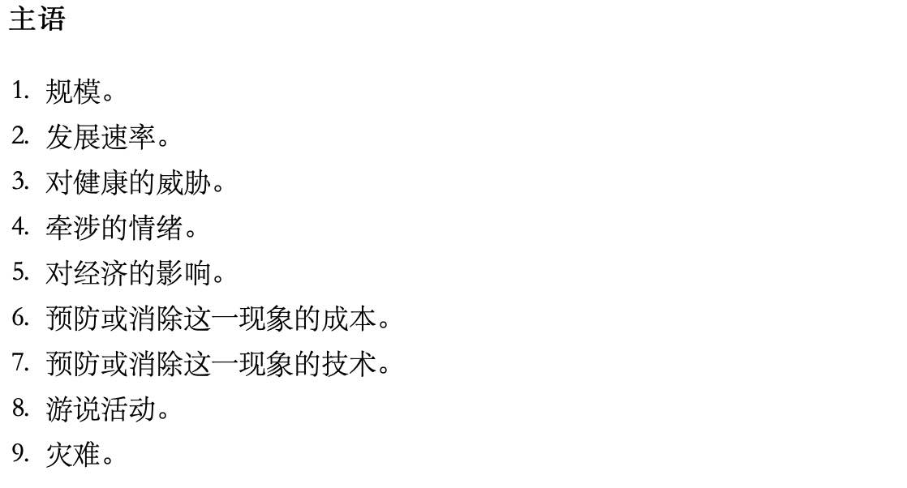
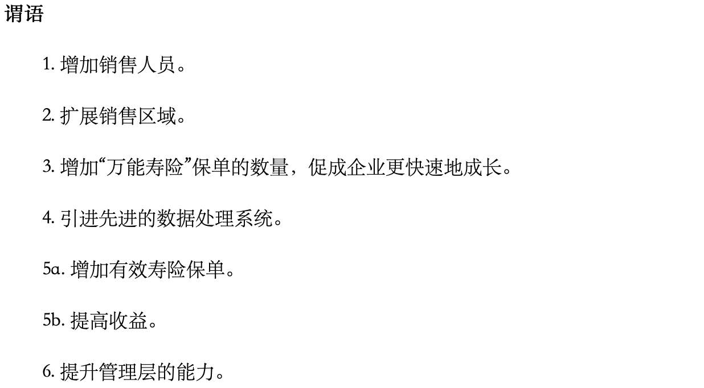

# 金字塔原理2-实战篇(第4篇): 提炼思想

# 练习6：严格检查每组思想

## 要点

得到一份草稿之后，需要对文字中的逻辑进行检查，包括：

* 每组思想必须具有某种逻辑顺序，而且没有遗漏任何思想。
* 上一层次的思想是对下一层次思想的概括、提炼和总结。

演绎推理法：大前提 ➡️ 小前提 ➡️ 推导 ➡️ 总结（比较简单：把推导出论点放在上一层作为结论、然后用“因为...”来概括其它内容）

归纳推理法：论点 ➡️ 分述 ➡️ 总结（三种逻辑顺序、两种总结方法：工6种组合）

* 三种逻辑顺序：时间顺序（前因后果）；结构顺序（部分整体）；程度顺序（重要性结构）
* 两种论点提炼方法：采取行动后取得的后果；结论之间的共性

## 6.1 确认逻辑顺序（归纳推理）

### 6.1.1 要点

| 顺序     | 因果关系                         |
| -------- | -------------------------------- |
| 时间顺序 | 确定前因后果关系                 |
| 结构顺序 | 将整体分割为部分或将部分组成整体 |
| 程度顺序 | 将类似事务按重要性归为一组       |

### 6.1.2 练习：确定每组思想中的逻辑顺序

#### 练习6A-1

#### 练习6A-2

#### 练习6A-3

#### 练习6A-4

#### 练习6A-5

#### 练习6A-6

 

## 6.2 找出基础结构

### 6.2.1 要点

任何一组思想必须符合3种顺序（时间、结构或程度）之一，如果无法在分好组的思想中找出任何一种顺序，这就表示你必须重新考虑你想要表达的内容。有五个步骤

1. 说明每一个思想的本质。

2. 把类似的思想归入同一组：
   * 如果是描述性思想，则按照共同点分类
   * 如果是行动性思想，则按照行动后获得的结果分类。
3. 确认分组的来源。
4. 按照逻辑顺序排序。
5. 选取重点。

### 6.2.2 练习：找出逻辑顺序

根据文字、找出逻辑顺序并理出论点、完成金字塔结构

#### 练习6B-1：专业零售商

论点描述

~~~txt
1. 零售商店的必要零配件库存充足，可以满足所有顾客的需要。
2. 训练有素的销售人员可以帮助顾客理清需要，然后向顾客推销他们所需要或与他们相关的产品。
3. 连锁商店设在当地主要商区，拥有统一的店面配置、产品搭配、商品价格和店员服务水平。
4. 产品价格有吸引力。可以直接从制造商处集中大量采购，折扣力度大。
5. 针对目标顾客群策划媒体营销活动。
~~~

论点本质

~~~txt
更多的库存。
更优秀的销售人员。
更好的店面位置。
更优惠的价格。
更好的广告效果。 
~~~

#### 练习6B-2：新的经营模式

#### 练习6B-3：项目计划超支的合理阐述

#### 练习6B-4：尖端信息系统

#### 练习6B-5：商机的评估

#### 练习6B-6：市场调查的目标

#### 练习6B-7：生产力计划的架构

#### 练习6B-8：直销成功的关键

## 6.3 说明采取行动后取得的结果

### 6.3.1 要点

位于金字塔结构顶端的思想是对下面思想的提炼和描述，可以是：

* 行动性思想（步骤、改革、建议、目标、……）：应该说明共性的出的推论
* 描述性思想（问题、原因、危险、……）：应该说明直接后果

行动行思想：

* 后果与步骤之间的因果关系应当能够体现出来
* 要用具体（而非“三个步骤”这样空洞）的语句来概括
* 做到上面两点、读者才能够去审视内容之间的因果关系是否成立(行动是否正确)

### 6.3.2 练习：找出因果关系、填充金字塔结构

#### 练习6C1：基金平台运营计划

#### 练习6C2：第一阶段的步骤

#### 练习6C3：关乎质量，不可妥协

#### 练习6C4：扩大GR的企业规模

#### 练习6C5：公司重组的指导原则

#### 练习6C6：医疗辅助市场

#### 练习6C-7：21世纪物流服务供应

#### 练习6C-8：BT航空的运营计划

## 6.4 说明结论之间的共性

### 6.4.1 要点

对于一组描述性论点，找出它们的共性，才能够进行概括并得出推论

推论的例子如下

~~~txt
* 公司存在许多问题
* 要进行变革的几种理由
* 有几个问题需要解决
~~~

如果这些论点符合以下要求，就说明这组思想具有某种共性：

~~~txt
* 针对同一类主语
* 针对同一类谓语
* 具有同一类隐含的思想
~~~

### 6.4.2 练习：

#### 练习6D-1：环境问题的发展

#### 练习6D-2：在土耳其设立一家度假旅馆

#### 练习6D-3：跨国计算机系统模型

#### 练习6D-4：佛罗里达联合银行

#### 练习6D-5：转换成开放式系统环境

#### 练习6D-6：公司合并的优点

