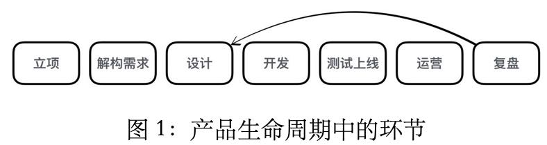
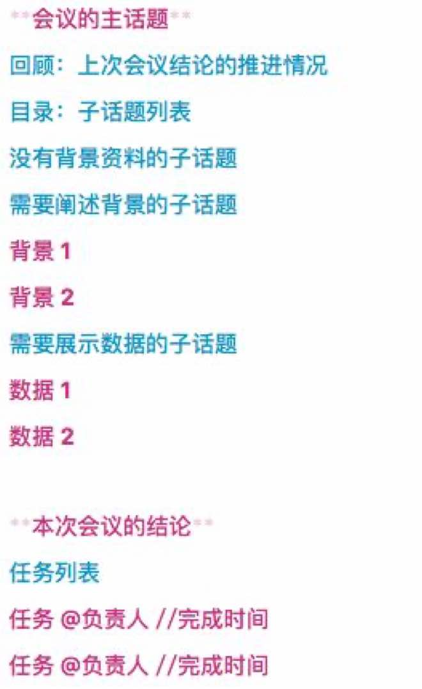
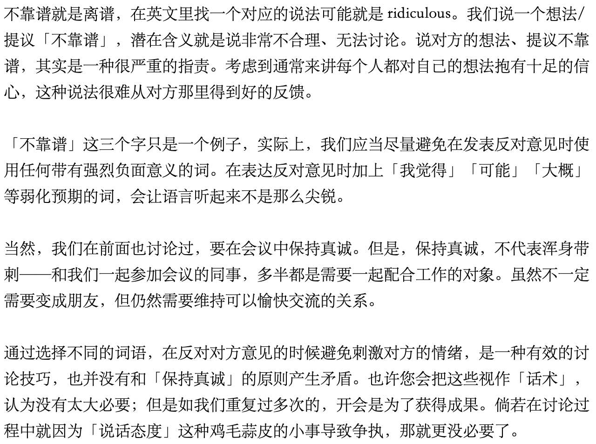
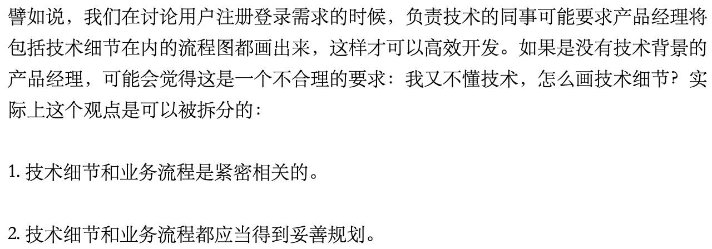
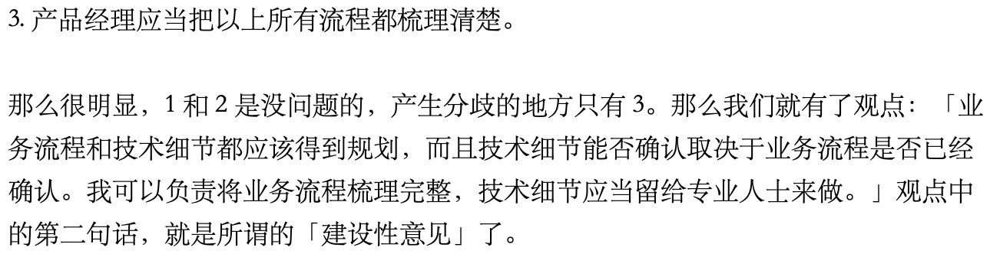

# 产品经理教你会议主持术

# 第1章：会议结构

## 1.1 为什么开会：建议契约与信息同步

### (1) 系统化组织：让项目更顺畅

系统化思考的好处是，具有全局观，而不是陷入到具体的纷乱繁杂中。具体可从两点入手

其一：将会议作为一个系统、拆分它的组成部分

其二：将整个项目作为一个系统，会议视为它的一个子系统，考虑会议与其他子系统（需求、设计、开发、测试、运营等）的逻辑关系

### (2) 安排得当：高效建立契约

邀约：会议议题、解决方案

承诺：大家讨论、达成共识、作出承诺

需要：强大的人格魅力推动达成共识；会议纪要；务实选择

### (3) 充分准备：快捷同步信息

“沟通不畅”造成项目问题（例如功能不符合需求）、需要所有人都能信息同步。然而信息创博需要成本。

其一：“随时同步”并不现实、定期同步可行

其二：充分准备的会议，才是最快捷的信息同步方式

怎样算充分准备： (1) 主持人对目的/主题 / 与会人 / 持续时间 / 场所等都有清晰答案； (2)  参会者对自己的角色/问题/希望得到的信息都有准备

## 1.2 要开哪些会

### (1) 产品会议

产品生命周期每个节点都需要：确定需求、产品形态、数据分析、讨论运营和营销策略

~~~txt
产品立项会：开天辟地的第一个会。一般由产品的发起人、技术负责人和产品负责人牵头，讨论产品的愿景、商业模式和解决方案。
需求分析会：将模糊的愿景和解决方案细化成可执行的具体功能的会议。由技术负责人、产品负责人牵头，得到产品的具体功能清单。
运营规划会：将产品的功能落地的规划会。由产品负责人、运营负责人牵头，得到产品的运营目标、运营策略和人员安排。
运营迭代会：分析、复盘运营策略的周期性会议。由产品负责人、运营负责人牵头，得到当前阶段的产品数据分析，以及对应的产品需求、运营策略调整。
~~~

### (2) 项目会议

检查项目进度、发现并解决项目浮现出的问题

~~~txt
项目立项会：项目组成立之后的第一个会。由产品负责人和技术负责人牵头，召集所有项目相关人，宣布项目开始的一次性会议。
项目规划会：一般和项目立项会合并，同样由产品负责人和运营负责人牵头，将产品需求分割为功能点，确认当前周期项目日程的周期性会议。
里程碑复盘会：由技术负责人牵头，在每个项目周期结束时组织的周期性会议，总结上一个项目周期的得与失。
~~~

# 第2章：系统化管理会议

管理会议：将会议和会议中的元素拆解、再组合，达到最优解

~~~txt
每一场会议，我们都应当以相同的高标准去准备，但这不代表我们不能将一些重复性工作抽象出来，用更巧妙的方法完成。
~~~

## 2.1 一次性会议与重复性会议

### (1) 一次性会议

要为之后很长时间的工作提供基本思路，例如：立项会议、需求分析会议

~~~txt
虽然这些会议只需要开一次，但我们大可不必对此感到紧张。首先，所谓的「只开一次」，时间范围多半是在一个产品周期之内，肯定不是一辈子只开一次；其次，在产品管理中一个常见的思路是保持「假设思维」，也就是说每个阶段做出的结论都是以当前情况做出的假设。

一个命题被定义为假设，就意味着它可以被修正，甚至被推翻。有的时候，最初设想的产品形态甚至会与这个产品真正成功时的最终形态相差十万八千里。
~~~

需要确认两个要点：(1) 讨论的话题是什么；(2) 什么时候复盘这个话题

~~~txt
第(2)点非常重要，因为会议中的“假设”会被证实或证伪，需要在特定的时间后进行修正
~~~

### (2) 重复性会议

例会：产品设计/开发/运营中的一个个循环周期

分为两种：(1) 派活的会；(2) 验收的会

| 环节     | 会议                                           |
| -------- | ---------------------------------------------- |
| 设计环节 | 需求沟通会；评审设计会                         |
| 开发环节 | 需求沟通会；阶段性评估会（通常简短）；敏捷站会 |
| 运营环节 | 运营规划会；运营复盘会                         |

## 2.2 判断会议价值

开会的成本：时间 * 人力

被邀请时对会议价值的评估：

~~~txt
一次性还是重复性会议？
话题属于产品管理、还是项目管理？
扮演角色时什么？
对项目的价值比较评估？
~~~

组织会议时对会议价值的评估：

~~~txt
这场会有必要开吗？
怎样的形式比较合适？
哪些人参加？
带来的价值怎样？
有其他方式吗？
~~~

## 2.3 随时可用的会议文档模版

### (1) 会议资料模版

会议资料：会议上要讨论话题的一份可视化文档

~~~
资料形式：(1) 提纲式；（2）PPT；（3）文档或邮件
(4) 对于重复性会议，可能需要回顾和跟进上次会议的结论和进度，需在资料中给这部分内容流出空间
~~~

会议资料与会议组织

~~~txt
1. 首先让与会者了解会议要覆盖的话题（例如给出子话题目录）
2. 讨论中只要提到某个子话题的名字，就可以立刻与文档中的资料对应上
3. 资料末尾给会议结论留出空间
~~~

会议资料模版

### (2) 会议纪要

内容：列出会议上重要的观点和结论

方法：记录在PPT的演讲者注释中，会议结束后稍加整理发出

# 第3章：开会也要有节俭的心态

## 3.1 对待头脑风暴

头脑风暴往往发生在拿不定主意的时候、需要大家的反馈和写作。但成本是：(1) 往往没有明确的目的；(2) 要拉着所有人。

组织头脑风暴之前，可以先想是否有其他的方式得到同事的协助、征求同事意见。例如

~~~txt
这个话题可能现在大家都还没有什么想法，要不我先去拟一封邮件/问卷，写一个讨论提纲发给大家，等大家都思考、沉淀一段时间之后，再组织讨论？
~~~

如果要组织头脑风暴，需要注意

~~~txt
1. 保证会议在合理的时间范围内结束
2. 像管理一场普通的会议一样保证每个人都有足够的发言时间
3. 结束之后要用邮件的方式追踪讨论的进程
~~~

## 3.2 提前预防迟到的人

~~~txt
如果是精挑细选的与会人，那么必然是缺了任何一个都无法完整讨论的；如果忽略迟到的人，直接开始讨论，又无法得到同步信息的效果
~~~

方法是：

(1) 通过邮件或即时通信软件设置自动提醒（小范围会议尽量设置单独提醒、避免群发消息被忽略）

(2) 会议开始时重要的人仍然没到、只能亲自打个电话

会议时间非常重要：短的会议一定要按时完成，长的会议一定要取得成果

# 第4章：设计不超时的高效会议

## 4.1 明确会议主题

#### (1) 确定会议的目的

每一场会议的目的，都可以写成「就某某话题达成共识」，确定了会议的目的就是确定了会议的主题

#### (2) 好的会议主题：明确

大的话题很难的出结论，应当拆分成几个小话题，拆分在不同会议中，分别达到共识

~~~txt
// 错误的例子（讨论范围太过发散）
注册登录功能设计

// 正确的例子（也可以写的再简短点，但一定要把讨论范围限制得足够清晰）
某某应用iOS版客户端注册界面与登录界面的视觉设计方案
~~~

## 4.2 为会议沟通做好准备

### (1) 如何准备沟通

需要对沟通的事务有足够了解，参与别人的会议要先明白讨论的话题是什么

~~~txt
信息充足的情况下，只要用枚举法找到需要的有效信息就够了。
在没有足够信息的情况下，需要现有最基础的调研
~~~

### (2) 避免过度准备

总有一部分信息是无法自己独立掌握的，如果强行“掌握”会适得其反。原则是：

1. 从最根本的需求、最关心的问题入手
2. 专注在自己角色的专长上、调动其他角色，将其他角色擅长的事务交给其他人来处理

## 4.3 确保同步沟通（马上得到反馈）

例如：视频会议、当面会议等（文字会议并不能确保得到反馈、是一种异步沟通）

## 4.4 参会人员

邀请对讨论议题有决策权的同事、以及具体执行这项任务的同事

应当为参会者提供与他付出时间成正比的信息

## 4.5 会议时间

重复性会议放在周一更有助于作用于一周的工作，放在早晨更有助于作用于一天的工作

## 4.6 拒绝跑题

要用可视化的方式管理会议议程，避免讨论跑题

### (1) 投影仪辅助

要讨论的话题用大字写在PPT上，每页一个话题

### (2) 用好白板

要避免堆砌毫无线索的词汇，图像胜于提纲

白板的好处是可以随擦随写，适合需要持续改动的东西（例如业务流程、模块间逻辑），随着讨论的持续，图形渐渐接近最终结论。结束时拍下来作为结论邮件同步给相关人员。

## 4.7 座位位置

| 场合                               | 座位                                       |
| ---------------------------------- | ------------------------------------------ |
| 向领导汇报成果的会议               | 自己（他是产品经理）应当与技术负责人并排坐 |
| 团队（产品团队）内部讨论需求的会议 | 最好是站着做宣讲                           |

原则：方便得到对方反馈

(1) 确定发言对象

(2) 一般坐在发言对象正对面、如果有若干不同的发言对象切作为分散可能就需要站起来。

## 4.8 本章要点

1.准备会议，第一件事是明确会议的主题。会议的主题应当被限制得尽量小，这样更容易在讨论中产出结果。

2.在会议当中应当以真诚的态度发言，明确自己的底线，管理好自己的情绪，并在非核心问题上做出必要的妥协。

3.准备会议时，应当邀请对讨论议题有决策权的同事和具体执行这项任务的同事。

4.安排会议的最好时段，是早上刚上班的第一个小时。

5.每一场会议都应当是同步沟通，用投影和白板来可视化地管理会议进程。

6.根据自己发言对象的位置，决定自己在会议室里坐在什么地方（或者站在什么地方）。

# 第5章：主持会议

会议主持人的责任：在各种工具辅助下，保证会议在既定的轨道上进行，得到会议成果

## 5.1 预先理清会议线索

从全面的视角入手，有助于理清楚会议陆续讲到的话题都有哪些

* 对于会议组织者，在会议资料准备过程中完成
* 对于会议受邀者，至少知道要讨论的话题、利用系统化思考的方法，考虑到涵盖的子话题

会议组织者需要把握会议节奏，清楚知道什么时候该推进到什么话题，合理分配各话题讨论时间

## 5.2 让每个人发挥价值

让每个人充分参与到讨论中，既包括听也包括说

* 引导沉默的同事发表看法
* 帮助叙述过多的同事总结核心观点、留出时间给其他同事

当话题偏离预定轨道、导致部分与会人不感兴趣时，需要礼貌打断（提示时间有限是否后续安排时间单独讨论）

## 5.3 保持好奇心

引导与会人更好地表达观点：当有人抛出观点时，引导对方说出支撑原因

~~~txt
“为什么？”
“这个问题可否解释下？”
“与X观点相比，这个观点的优势时什么”
~~~

但对于不想关话题，也要及时打断而不是追问

## 5.4 处理“野生”话题

“野生”话题：在会议过程中迸发出来的话题。

有两种

* “阻塞式”：绕不开，得不出结论就无法继续讨论
* “异步式”：不论结论如何，都不影响既定议题讨论

不能只依靠参会人发言来为这些话题作出决定（此时每个人都为自己的立场据理力争），而是尽量回到会议本身。

方法是考虑以下两个问题：

1. 当前的话题如果没有结论，会不会阻碍会议达成预期的成果？

2. 当前的话题是否和所有参会人相关？

如果都是“否”，可以建议暂时搁置，后续单独讨论

## 5.5 挽救即将失败的会议

如果其他参会的同事“爆炸”了，讨论话题从“业务”或“功能”变成了“人”，就是会议失败的风险信号。例如

~~~txt
「这个功能不符合我们之前的需求」—— 安全，没问题。
「你做的这个功能不符合我们之前的需求」—— 注意！要出事！
~~~

发现非理性讨论的苗头：

(1) 要尽量将讨论者注意力集中到原本的话题上

(2) 干脆临时跳过当前话题，直接推进到下一个话题（引发争议的话题可以事后私下再协调和讨论）

最坏的情况：在毫无征兆的情况下，参会人之间发生了非理性冲突，如果已经到了这一步，就直接提前宣布会议结束，不在浪费所有人的时间。

## 5.6 快速和明确收尾

在会议结束之前：

回顾话题

* 将所有已经讨论的话题复述一遍（包括预先计划的，以及有价值的野生话题）
* 同时将每个话题达成的结论复述一遍（如果某个话题没有达成结论，那么也要向大家说明目前讨论到什么地步）

和参会者确认

* 是否需要安排下一次会议，如果需要的话大概会安排在什么时候
* 会议的结论需要什么人去推进，每一项工作的时间节点是怎样的

在短时间内完成这些，就需要在会议进程中将话题和结论组织成要点（前面会议文档模版一节中有介绍）

## 5.7 本章要点

主持会议也要遵守基本法:

1. 严格遵守会议的开始时间。
2. 在开头就议题的要旨做一番简洁的说明。
3. 把会议事项的进行顺序与时间的分配预先告知与会者。
4. 在会议进行中要注意如下事项：
   * 发言内容是否偏离了议题?发言内容是否出于个人的利害?
   * 是否全体人员都专心聆听发言?
   * 是否发言者过于集中于某些人?
   * 是否有从头到尾都没有发言过的人?
   * 是否某个人的发言过于冗长?发言的内容是否朝着结论推进?5.应当引导在预定时间内做出结论。
5. 在必须延长会议时间时，应取得大家的同意，并决定延长的时间。
6. 应当把整理出来的结论交给全体人员表决确认。
7. 应当把决议付诸实行的程序理出，加以确认。

# 第6章：用积极的态度说“不”

## 6.1 真实表达但不要“爆炸”

用心准备的讨论，需要在会议上用真诚的态度表达出来。

### (1) 守住底线

观点冲突时怎么办：拆解目标、分成若干个简单问题，这样分别得到结论的可能性会增大

要明确自己的底线时什么：也需要拆分话题，从不同维度拆解，从中找出真正的底线，并论证它的必要性。例子如下

~~~txt
会议上讨论的话题是「某某应用iOS版客户端注册界面与登录界面的视觉设计方案」。或许一开始，我们的观点是「直接照搬Instagram的注册界面」；但拆分之后，我们会发现自己实际上想学的是「默认使用手机号注册，并且只需要输入一遍密码」。再度拆分，这个想法的真正目的，是为了「让用户用较低的成本注册成功，同时获得手机号，以便用户关闭了app推送的时候还能用短信发送通知」。这样就会发现，我们的真实目的有两个：「降低用户注册成本」，以及「备用的推送渠道」。

「降低用户注册成本」、「获得备用推送渠道」，这两个论述，可比最初「照搬Instagram注册界面」的说服力强得多了。不仅如此，它也更加接近自己真实的要求。想要在会议中守住自己的底线，先做到了解自己真正的目的，是最本质的解决方案。
~~~

### (2) 不要“爆炸”

会议上的一次爆发，很可能就意味着这次讨论的终结。不管之前多么「用心」，在非理性的情绪化讨论中，都很难继续前进、得到结果了。

~~~txt
不管在会议上发生了怎样的对白，都不要爆发。这是一件既伤身体，又对项目进度有百害无一利的事情。在「爆炸」之前，请自己在心里从一默念到十，然后仔细思考应当如何拆解问题，如何从不同的角度解读目标，才是解决争论、让会议最终得到成效的方法
~~~

## 6.2 可以说“不靠谱”吗？

## 6.3 提出建设性意见

发现问题容易、找到解决方案却并不容易。如何快速提出建设性意见？

* 仍然用系统化思考去分析问题
* 将观点拆分成子观点，找到产生分歧的地方

例如

## 6.4 本章要点

1. 表达反对意见时应当避免使用负面词汇。

2. 表达反对意见时应当尽量提出建设性意见，通过系统化分析对方的命题，可以找出其中的可取之处，同时也可以找到改进的方案。

# 全书要点回顾

这本书里讨论的方法，本质上是系统化思考在不同场景下的具体应用。

1. 需要系统化地理解产品生命周期中的会议结构。产品经理要开的会取决于自己的职能，从职能的角度讲可以分为产品会议和项目会议，从实践的角度讲可以分为一次性会议与重复性会议。

2. 主持一系列成功的会议，前提是系统化地组织、管理会议。通过系统化管理会议文档，可以有效地管理会议本身。会议的准备、进行和会后推进的过程，可以通过完善的会议文档模板，把一系列工作变成一个整体。
3. 应当以节俭的态度安排和参加会议，不要组织或参加注定没有成果的会议。如果必须参与难有成果的会议，请尝试用系统化的方法掌握会议的进程，以得到较好的结果。
4. 组织会议时，要确保每一场会议都应当是同步沟通；在同步沟通的前提下，可以用投影和白板来可视化地管理会议进程。作为主持人，需要根据自己发言对象的位置，决定自己在会议室里坐在什么地方（或者站在什么地方）。
5. 用心准备和参与会议，把一场会议拆解再重新组合。会议的主题应当被限制得尽量小，这样更容易在讨论中产出结果。在会议当中应当以真诚的态度发言，明确自己的底线，管理好自己的情绪，并在非核心问题上做出必要的妥协。
6. 准备会议时，应当邀请对讨论议题有决策权的同事和具体执行这项任务的同事。安排会议的时间，需要注意避免干扰与会人的正常工作，一般来说最合适的时段是早上刚上班的第一个小时。
7. 作为主持人，在会议当中需要用各种技巧激发与会人的价值。不仅需要引导与会人参与讨论，也要注意在出现干扰会议进程的情况时及时将话题引回会议中来。
8. 在会议中要诚实地表达反对意见，但是表达反对意见时应当尽量提出建设性意见，通过系统化分析对方的命题，可以找出其中的可取之处，同时也可以找到改进的方案。

